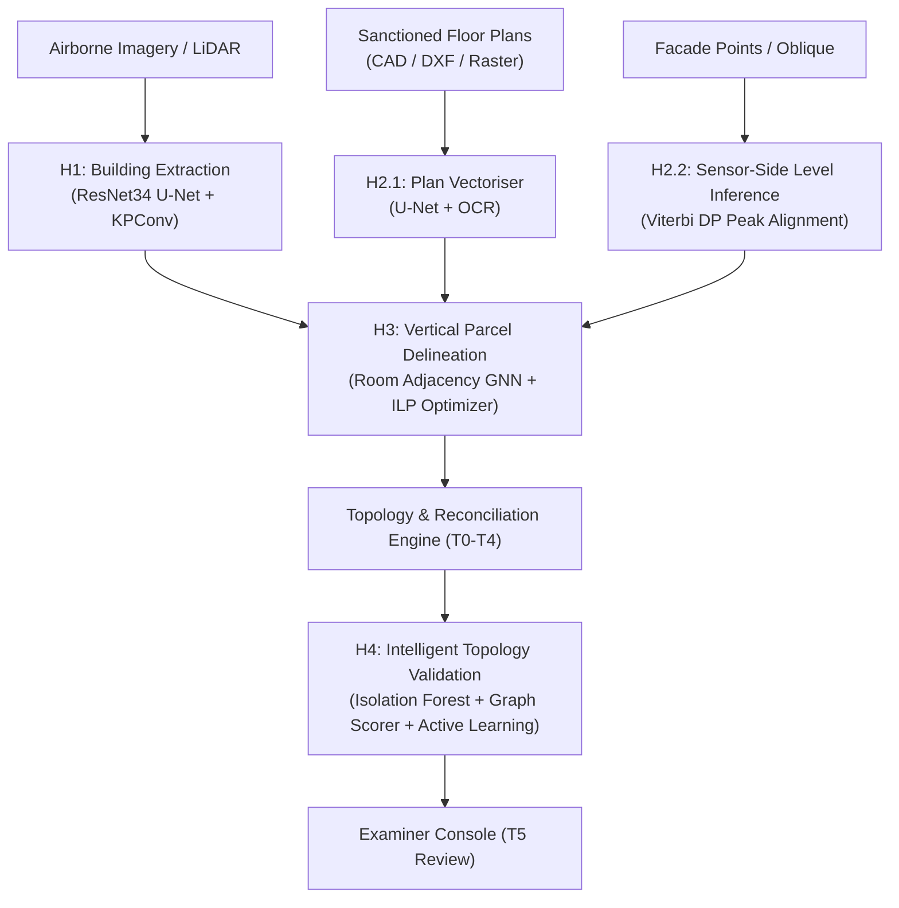

# 6. AI/ML Subsystem Technical Specifications

The system deploys four dedicated AI/ML subsystems (H1 through H4) designed to process multi-modal geospatial inputs, segment floor plans, delineate 3D legal unit volumes, and intelligently triage topological anomalies.



---

### 6.1 H1 — Automated Building Extraction (R20)

**Objective:** Segment building footprints and roof surfaces from airborne imagery and point clouds.

**Architecture:**

```
Input:
  +-- ORI (orthorectified image) — GeoTIFF, 3-band RGB
  +-- nDSM (normalised Digital Surface Model) — GeoTIFF, 1-band float32

Model: U-Net Encoder-Decoder
  +-- Encoder: ResNet-34 backbone (pre-trained on ImageNet)
  +-- Input: 4-channel tensor (R, G, B, nDSM), tile size 512x512 px
  +-- Decoder: Transposed convolutions with skip connections
  +-- Output: 2-class segmentation mask (building / not-building)

Point-Cloud Branch (optional):
  +-- Input: LAS/LAZ classified point cloud
  +-- Model: KPConv or RandLA-Net-class semantic segmentation
  +-- Classes: ground, building, vegetation, other
  +-- Output: per-point label + building-envelope extraction
```

**Loss Function:**

```
Loss = alpha * BCE(y, y_hat) + (1 - alpha) * Dice(y, y_hat)
```

where `alpha = 0.5` (balanced), `BCE` is binary cross-entropy, and `Dice` is the soft Dice loss to handle class imbalance.

**Metrics:**

| Metric | Description | Target |
|--------|-------------|--------|
| IoU (Intersection over Union) | Pixel-level segmentation quality | Reported per provenance class |
| Boundary F1 | Precision/recall on building boundary pixels (tolerance: 2 px) | Reported per provenance class |
| Height MAE | Mean absolute error of extracted height vs ground truth | Reported in metres |

**Training Data:**

| Source | Provenance | Role |
|--------|-----------|------|
| Synthetic renders over real Mumbai/Bengaluru footprints | SYNTHETIC | Training + held-out evaluation |
| Rotterdam AHN + open aerial imagery | REAL-FOREIGN | Algorithm benchmark (sensor noise) |
| Own-capture (if done) | REAL-OWN | End-to-end validation |

**Known Failure Modes:** Shadows, dense slum/informal settlements, glass facades (LiDAR dropout), occlusion by adjacent towers.

---

### 6.2 H2 — Floor & Plan Segmentation (R21)

**Two sub-pipelines:**

#### 6.2.1 Plan-Side Vectoriser

```
Input: Raster floor plan (scanned drawing / RERA PDF / AutoDCR DXF screenshot)

Pipeline:
  1. Pre-processing: binarise, de-noise, de-skew
  2. Wall detection: U-Net segmentation (walls/doors/windows/rooms)
  3. Room polygon extraction: contour detection => polygon simplification
  4. Text recognition: OCR for room labels, dimensions, area notations
  5. Level reconstruction: stack multiple floor plans vertically
  6. Output: Structured floor-plan JSON
       { levels: [{ level_no, rooms: [{ polygon, label, area }], shafts, stairs }] }
```

**Training Strategy:**

1. Pre-train on CubiCasa5K (Finnish plans, public)
2. Fine-tune on synthetic Indian-style plans (parametric generator matching AutoDCR schema)
3. Test on held-out RERA-disclosed real plan rasters
4. Report domain gap explicitly between sets

#### 6.2.2 Sensor-Side Level Inferencing

Uses the Viterbi/DP height-inference algorithm (detailed in [pipeline.md](pipeline.md#44-height-inference-algorithm-viterbidp-peak-alignment)):

```
Input: Facade point cloud / oblique imagery features

Output per level:
  { z_obs, sigma, n_support, evidence_class, status: PASS|WARN|FAIL|UNVERIFIABLE }
```

**Metrics:**

| Metric | Description |
|--------|-------------|
| Room/wall IoU | Pixel-level agreement with ground-truth plan segmentation |
| Level count accuracy | Exact match, +/-1 match rates |
| z-error | MAE and RMSE of detected level heights vs ground truth |

---

### 6.3 H3 — Vertical Parcel Delineation (R22)

**Objective:** Propose unit partitions and vertical extents; snap to plan topology.

**Architecture:**

```
Input:
  +-- Expected model (from plan parser): level polygons, room adjacency graph
  +-- Observed model (from sensors): detected level planes, envelope
  +-- Constraints: volume conservation, no-overlap, containment

Model: Learned Proposal + Constrained Optimisation
  1. Graph Construction:
     - Nodes = candidate room/space polygons per level
     - Edges = adjacency (shared wall segments)

  2. Learned Proposal Network:
     - GNN over the room adjacency graph
     - Predicts: merge probability for adjacent rooms => unit groupings
     - Features: room area, aspect ratio, adjacency type, level position

  3. Constrained Optimisation:
     - Objective: maximise proposal network score
     - Subject to:
       a. Exact cover: every room assigned to exactly one unit
       b. Volume conservation: sum(vol(units)) + sum(vol(voids)) + sum(vol(common)) = vol(level)
       c. Connectivity: each unit is one connected component
       d. Plan agreement: unit count matches RERA-disclosed count (when available)
     - Solver: Integer Linear Programme (ILP) or graph partition heuristic
```

**Metrics:**

| Metric | Description |
|--------|-------------|
| Volume IoU per unit | 3D overlap between predicted and ground-truth unit volumes |
| Unit-count accuracy | Exact match rate for number of units per level |
| Partition quality | Percentage of room assignments matching ground truth |

---

### 6.4 H4 — Intelligent Topology Validation (R23)

**"Intelligent" is defined explicitly:** (i) uncertainty-aware predicates, (ii) explanations, (iii) learned ranking, (iv) adaptive tolerances — not just DE-9IM checks. ML is triage; humans decide.

**Architecture:**

```
Input:
  +-- Adjacency graph of all spatial objects in a building
  +-- Validation results from T0-T4 tiers (rule violations with features)
  +-- Historical examiner decisions (for active learning)

Feature Vector per Finding:
  [ violation_type, magnitude, sigma, confidence, evidence_class,
    affected_class_pair, volume_ratio, n_affected_objects,
    plan_version_age, data_provenance ]

Model: Isolation Forest + Graph-Based Anomaly Scorer
  1. Isolation Forest: per-finding anomaly score on feature vector
  2. Graph propagation: anomalies that affect connected objects propagated
  3. Ranking: findings sorted by (anomaly_score * impact * examiner_priority)
  4. Output: ranked finding list for examiner review

Active Learning Loop:
  1. Present top-ranked findings to examiner
  2. Examiner decisions: ACCEPT / REJECT / MODIFY_TOLERANCE
  3. Update: tolerance parameters re-calibrated; model re-trained
  4. Seed: NAKSHA's 5% parcel-area tolerance as initial calibration point
```

**Metrics:**

| Metric | Description |
|--------|-------------|
| Precision@k | Fraction of top-k findings that examiner confirms as genuine |
| Recall per defect class | Detection rate per defect type |
| Examiner workload reduction | Percentage of findings correctly auto-triaged vs manual review |
