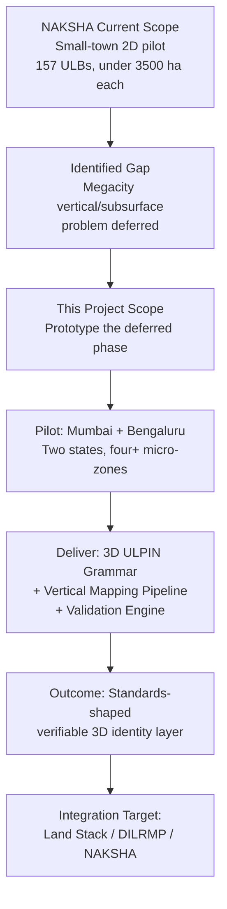
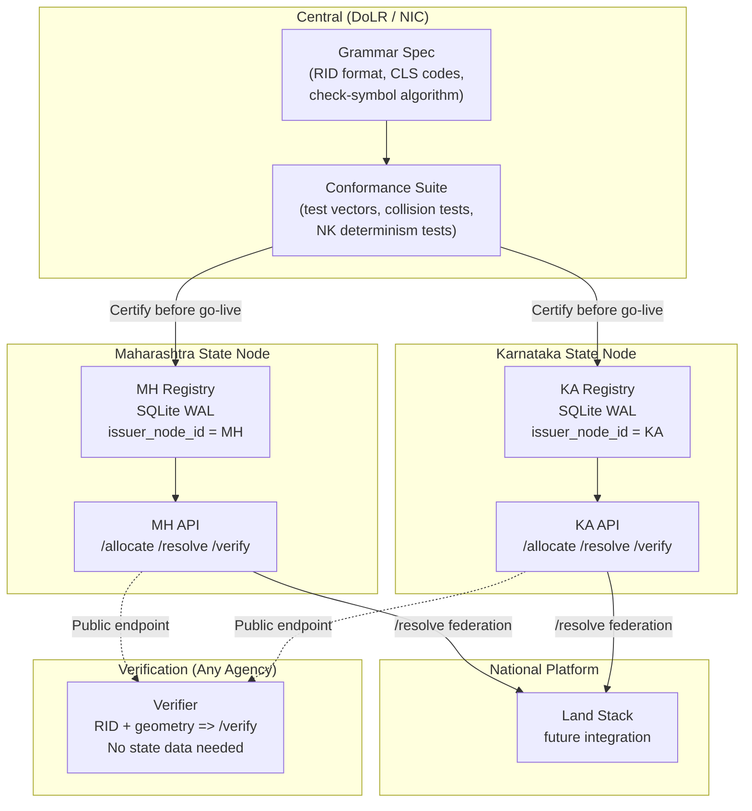

# Master Architecture Document — 3D ULPIN Generation & Vertical Property Mapping System

**Project:** SIH26011  
**Version:** 1.0 (Modularized Architecture)  
**Date:** 2026-09-20  
**Classification:** Production-Ready Core Architecture Specification  

> **India-First Design Doctrine (A3):** Every design element is anchored to Indian law, Indian institutions, and Indian data availability. Foreign systems (Singapore SLA, Netherlands Kadaster, Victoria ePlan) are read as case studies with explicit adopt / adapt / reject decisions — never as templates. Where Indian precedent exists (NAKSHA's 5% tolerance, ULPIN's geometry-derived ID, RERA's carpet-area definition), it is the default.

> **Data Provenance Principle:** Every object carries `data_provenance ∈ {REAL, REAL-FOREIGN, REAL-OWN, PROXY, SYNTHETIC}`. Simulated data is never presented as official survey data.

> **Honesty Metric:** `UNVERIFIABLE` is a first-class validation state, not an error.

---

## Modular Architecture Navigation Index

To keep specifications clean, modular, and maintainable, the architecture dossier is partitioned into dedicated domain specifications located in the same directory:

| Document | Primary Domain | Core Contents |
|----------|----------------|---------------|
| [architecture.md](architecture.md) | **Master Architecture Hub** | System Overview, R1–R30 Traceability Matrix, Layered System Diagram, Federated Multi-State Model, MVP Cut |
| [data.md](data.md) | **Data & Sourcing** | Pilot Micro-Zones (MZ-1–4, BZ-1–3), Namma Metro & Aqua Line alignments, 3-Tier Spatial Fidelity, Data Ledger Matrix (REAL/FOREIGN/SIMULATED), Sim-to-Real Protocol, DPDP Act Compliance |
| [features.md](features.md) | **Identity & Grammar** | 3D ULPIN Formal Requirements (P1–P11), RID Grammar, ISO 7064 MOD 37,36 Algorithm, Object Class Taxonomy (S, B, L, U, C, P, A, T, E, I), Natural Key (NK) Canonicalization, Spatial Address (SA) Grid, Identity Continuity Test (ICT), Conformance Suite |
| [pipeline.md](pipeline.md) | **Processing Pipeline** | Plan-First Evidence-Verified Workflow, Evidence Sufficiency Ladder (E1–E5), Georegistration & Error Covariance Propagation, Viterbi Height Inference |
| [aiml.md](aiml.md) | **AI/ML Subsystems** | AI/ML Subsystems (H1 Building Extraction, H2 Floor Segmentation, H3 Vertical Parcel Delineation, H4 Intelligent Topology Validation), loss functions, failure modes, active learning loop |
| [validation.md](validation.md) | **Topology & QA Engine** | Multi-Tier Validation Pipeline (T0–T5), Mathematical Spatial Predicates (Overlap, Volume Conservation, Containment, Connectivity, Order), Monte-Carlo Uncertainty Testing, Hungarian Plan-to-As-Built Reconciliation, Explain Object Schema, Defect Taxonomy (28+ classes), Evaluation Programme |
| [contracts.md](contracts.md) | **API Contracts** | OpenAPI REST Endpoint Specifications: `POST /allocate`, `GET /resolve/{rid}`, `POST /verify`, `GET /lineage/{rid}`, `GET /cover`, `GET /explain/{finding_id}`, `GET /validate/{rid}` |
| [config.md](config.md) | **Platform & Governance** | Single-Process Python Tech Stack, Non-Functional Performance Targets, Phased Government Deployment Roadmap (Phase 1–5), Inter-Agency Contact Matrix, Examiner Console Specifications, Standards Stack, Dependency-Ordered Build Plan |
| [decisions.md](decisions.md) | **Decisions & Scenarios** | Architectural Decisions & Adopt/Adapt/Reject Matrix, LADM Part 2 India Profile, Rights/Responsibilities/Restrictions (RRR) Schema, Legal Overlap Semantics, Legacy Crosswalk (CTS/PID/UPOR/RERA), Real-World Conflict Workflows, Novelty Claims (1–10), Risks & Limitations, Judge Q&A, Research Questions (RQ1–RQ6), Concrete Multi-City Scenarios |
| [implementation_plan.md](implementation_plan.md) | **Implementation Plan** | 12-Step Granular Engineering Build Plan (Steps 0–11), Directory Layout, Sub-tasks, Deliverables, Acceptance Criteria, Testing Pyramid, Milestone Checkpoints, Risk Register |

---

## 1. System Overview & Problem Statement Decomposition

### 1.1 Executive Summary & Mission Statement

India's existing land-record systems — ULPIN, DILRMP, NAKSHA — identify **surface parcels only**. In megacities such as Mumbai and Bengaluru, property exists vertically: multi-storey apartments, multi-level basements, underground metro tunnels, elevated transit corridors, subsurface utility networks, and air-right development zones. A 2D parcel identifier cannot answer the question *"what is below / above this plot?"* — the single most critical query for urban property governance.

**Mission:** Design, implement, and demonstrate a **3D ULPIN Generation and Vertical Property Mapping System** that:

1. Extends (not replaces) the existing 14-character ULPIN with a class-typed, verifiable, persistent 3D identity grammar.
2. Maps vertical and underground ownership rights using a plan-first, evidence-verified pipeline.
3. Validates 3D spatial topology under measurement uncertainty with explicit honesty about what can and cannot be verified.
4. Demonstrates interoperability across two Indian states (Maharashtra and Karnataka) using the same grammar with federated registry nodes.
5. Grounds every design decision in Indian law and institutions, using international systems only as pattern evidence.

**NAKSHA Scope Finding:** NAKSHA (DoLR) has deliberately targeted small, administratively manageable towns (municipalities under ~3,500 hectares and 200,000 population) and has **publicly deferred the megacity, high-rise, multi-basement, metro-corridor problem** to a later phase (Frontiers 2026, peer-reviewed). This project prototypes exactly that deferred next phase.

---

### 1.2 Requirement Traceability Matrix

Every noun in the Problem Statement is decomposed into a numbered requirement (R-ID) with a component, a data source, and a test. This table also serves as the final acceptance checklist.

| R-ID | PS Text (Paraphrased) | Layer | Commitment | Primary Component | Data Source | Acceptance Test | Detailed Spec |
|------|----------------------|-------|-----------|-------------------|------------|-----------------|---------------|
| R1 | 2D record systems inadequate for vertical cities | Background | Quantified failure case of 2D and its 3D resolution on real Mumbai/Bengaluru parcels | Data / Decisions | MCGM GIS, UPOR | Demo: "what is below this parcel?" returns stacked RIDs | [decisions.md](decisions.md) |
| R2 | Existing systems identify surface parcels only | Background | Extend, do not replace, existing ULPIN | 3D ULPIN Core | DoLR ULPIN spec | ULPIN14 prefix unchanged; P3 backward compatibility | [features.md](features.md) |
| R3 | Uniquely define ownership rights for **multi-storey apartments** | Background | Level/Unit/Common/Accessory identities + rights records | Identity / Rights | RERA, Apartment Ownership Acts | U/C/P classes with RRR records | [features.md](features.md), [decisions.md](decisions.md) |
| R4 | **Underground infrastructure** | Background | Subterranean lots + utility-network segments | Identity / Mapping | Metro alignments, simulated utilities | T/I classes exercised on BZ-1, MZ-1 | [data.md](data.md), [features.md](features.md) |
| R5 | **Elevated transport corridors** | Background | Elevated-corridor volumes crossing multiple parcels | Identity / Topology | BMRCL/MMRC public data | E class with SPANS relation | [features.md](features.md), [data.md](data.md) |
| R6 | **Parking spaces** | Background | Accessory/limited-common spaces linked to units | Rights / Identity | RERA counts | P class linked to U via Right | [features.md](features.md), [decisions.md](decisions.md) |
| R7 | **Air-rights** | Background | Airspace volumes above parcels/buildings | Identity / Rights | TDR/FSI rules | A class, `legal_basis_status = ASSUMED` | [features.md](features.md), [decisions.md](decisions.md) |
| R8 | **Subsurface utility networks** | Background | Utility segments with depth uncertainty | Identity / Topology | Simulated (no open national dataset) | I class with conflict detection | [features.md](features.md), [decisions.md](decisions.md) |
| R9 | Build a **3D ULPIN generation** system | Description | Grammar, generator, verifier, registry, lifecycle | 3D ULPIN Engine | — | Conformance suite passes | [features.md](features.md) |
| R10 | **Vertical property mapping** | Description | Vertical parcel delineation pipeline | Pipeline | Plans + sensors | Unit volumes extracted and validated | [pipeline.md](pipeline.md) |
| R11 | Unique spatial identities for **surface parcels** | Description | Class S (surface column) IDs | Identity | Overture/MCGM/UPOR footprints | S-class RID allocated | [features.md](features.md) |
| R12 | … for **multi-storey apartments** | Description | Classes B/L/U/C/P | Identity | RERA counts, synthetic plans | Full vertical stack allocated | [features.md](features.md) |
| R13 | … for **underground infrastructure** | Description | Classes T/I | Identity | Metro alignments, synthetic utilities | T/I classes allocated | [features.md](features.md) |
| R14 | Integrate **drone imagery** | Description | Ingestion → ortho/mesh → evidence | Ingestion / Pipeline | UPOR workflow; Rotterdam tiles; synthetic renders | Pipeline processes real or synthetic imagery | [pipeline.md](pipeline.md), [data.md](data.md) |
| R15 | Integrate **LiDAR / 3D point cloud** | Description | Ingestion → classification → planes/levels | Ingestion / Pipeline | Rotterdam AHN (real); ray-cast simulator | Height extraction from point clouds | [pipeline.md](pipeline.md), [data.md](data.md) |
| R16 | Integrate **GIS parcel layers** | Description | Parcel/ULPIN layer as parent anchor | Ingestion / Registry | MCGM GIS, UPOR/e-khata, Overture | S-class geometry from real footprints | [data.md](data.md) |
| R17 | Integrate **building floor plans** | Description | Plan ingestion (CAD/IFC/raster) → expected 3D model | Plan Parser | AutoDCR schema, RERA plans, synthetic | Expected model built from plans | [pipeline.md](pipeline.md) |
| R18 | Integrate **GNSS/CORS coordinates** | Description | Georegistration + uncertainty model | Georegistration | SoI CORS (~±3 cm RTK) | Σ propagation through pipeline | [pipeline.md](pipeline.md) |
| R19 | Integrate **DEM/DSM** | Description | nDSM heights, ground reference, level priors | Pipeline / Ingestion | Bhuvan/SRTM coarse; simulated fine | Ground reference established | [pipeline.md](pipeline.md) |
| R20 | AI/ML **automated building extraction** | Description | Trained extractor + metrics | Subsystem H1 | Synthetic renders + Rotterdam real | IoU, boundary F1 reported | [aiml.md](aiml.md#61-h1--automated-building-extraction-r20) |
| R21 | AI/ML **floor segmentation** | Description | Plan-side and sensor-side | Subsystem H2 | Synthetic Indian plans + RERA test | Room/wall IoU, level accuracy | [aiml.md](aiml.md#62-h2--floor--plan-segmentation-r21) |
| R22 | AI/ML **vertical parcel delineation** | Description | Constraint-guided delineation | Subsystem H3 | Simulated buildings | Volume IoU per unit | [aiml.md](aiml.md#63-h3--vertical-parcel-delineation-r22) |
| R23 | AI/ML **intelligent topology validation** | Description | Rule engine + uncertainty-aware + learned ranking | Subsystem H4 / Validator | Simulated defects | Precision/recall per defect class | [aiml.md](aiml.md#64-h4--intelligent-topology-validation-r23), [validation.md](validation.md) |
| R24 | Scalable, interoperable 3D cadastral framework | Expected | Tiling/index, standards mapping, layered architecture | Core Architecture | — | Two state nodes, same grammar | [architecture.md](architecture.md#4-federated-multi-state-registry-architecture) |
| R25 | Generate **standardised** 3D ULPINs | Expected | Published grammar + test vectors + conformance suite | Identity Core | — | 10^7 allocations, zero collisions | [features.md](features.md) |
| R26 | Map **vertical and underground ownership rights** | Expected | Rights model linked to 3D IDs, India-profiled | Legal Rights Model | Apartment Ownership Acts, RERA | RRR schema populated | [decisions.md](decisions.md) |
| R27 | Support **volumetric cadastre** systems | Expected | LADM Part 2 / IFC / CityGML mapping | Interoperability | ISO 19152-2:2025 | Round-trip export/import | [decisions.md](decisions.md), [config.md](config.md) |
| R28 | Enable accurate **urban property governance** | Expected | Examiner workflow, audit trail | Examiner Console | — | Hash-chained log, sign-off | [config.md](config.md) |
| R29 | **Reduce ownership conflicts and ambiguities** | Expected | Discrepancy classes with measured detection | Reconciliation Engine | Injected defects | Detection-vs-magnitude curves | [validation.md](validation.md) |
| R30 | Improve **infrastructure planning and utility management** | Expected | Utility-vs-parcel/basement conflict queries | Query / Governance | Named scenarios | Conflict queries demonstrated | [decisions.md](decisions.md) |

---

### 1.3 Problem Resolution Strategy for Megacity 3D Cadastres



**Strategic Principles:**
1. **Do not duplicate NAKSHA** — extend it into the domain it has publicly deferred.
2. **Anchor to existing Indian identifiers** — ULPIN14 as the parent, CTS/PID/UPOR/RERA as cross-walked legacy IDs.
3. **Plan-first, evidence-verified** — building plans define the expected 3D model; sensors verify it; discrepancies are classified, not hidden.
4. **Honest about limits** — `UNVERIFIABLE` for insufficient evidence, `legal_basis_status` for untested legal effects, `data_provenance` for every object.
5. **Federated by design** — central grammar, state-level registry nodes, because land is a State subject.

---

## 2. Core Three-Layer Identity Architecture Summary

To reconcile geometry verifiability with persistence across physical remodeling (the fundamental P2 vs P5 tension), the system implements a **Three-Layer Identity Architecture** linked via an immutable binding record:

```
+--------------------------------------------------------------------------+
| LAYER 1  REGISTRY ID (RID)     persistent, opaque, class-typed, checked  |  <- the "3D ULPIN" string
+--------------------------------------------------------------------------+
| LAYER 2  NATURAL KEY (NK)      deterministic function of canonical       |
|          geometry @ version:   locator (interior point) + digest         |  <- verifiability (ULPIN-style)
+--------------------------------------------------------------------------+
| LAYER 3  SPATIAL ADDRESS (SA)  multi-resolution 3D grid cell cover       |  <- search / tiling / joins
+--------------------------------------------------------------------------+
             bound by  =>  BINDING RECORD (hash-chained version log)
       RID <=> NK(v) <=> SA(v) <=> evidence set <=> plan version <=> sign-off <=> parent lineage
```

- **RID Grammar:** `ULPIN14 - BLD - CLS SEQ - CHK` (e.g. `SYNTHETIC0001A-B0004-U0A3F1-7`)
- **Check Symbol:** ISO 7064 MOD 37,36 with 100% single-substitution and adjacent-transposition detection.
- **Natural Key (NK):** Canonical polyhedron serialization + base32 SHA-256 digest + 3D Morton locator.
- **Identity Continuity Test (ICT):** Governs whether modified geometry maintains the same RID (`CONTINUE`), requires human review (`AMBIGUOUS`), or triggers `SPLIT` / `MERGE` / `NEW`.

*For complete formal definitions, check symbol implementation, and conformance vectors, see [features.md](features.md).*

---

## 3. End-to-End System Architecture (Layered Model)

The entire runtime is structured into 9 coherent architectural layers (L0 to L8):

```
+------------------------------------------------------------------------------+
| L0  DATA PROVENANCE LAYER                                                    |
|     Every object: data_provenance in {REAL, PROXY, SYNTHETIC}                |
|     Source, CRS, datum, resolution, accuracy metadata                        |
|     Real anchors: MCGM GIS/AutoDCR, UPOR/e-khata, Overture, SoI CORS, DEM  |
+------------------------------------------------------------------------------+
| L1  INGESTION LAYER                                                          |
|     GDAL/PDAL/IfcOpenShell/ezdxf readers                                    |
|     Format adapters: DXF, LAS/LAZ, GeoTIFF, GeoJSON/Shapefile              |
|     Each adapter emits normalised internal geometry + provenance tag         |
+------------------------------------------------------------------------------+
| L2  NORMALISATION & GEOREGISTRATION LAYER                                    |
|     CRS + datum unification; canonical geometry (NK algorithm)               |
|     CORS/GCP + ICP alignment; covariance Sigma propagation                   |
+------------------------------------------------------------------------------+
| L3  EVIDENCE & EXPECTED-MODEL LAYER                                          |
|     Evidence store (local files, W3C PROV) || Expected model builder         |
|     Plan => 3D legal-space model; reconciled downstream                      |
+------------------------------------------------------------------------------+
| L4  ML/CV EXTRACTION LAYER (H1-H4)                                          |
|     Building extraction => floor/level segmentation => vertical delineation  |
|     => anomaly ranking. In-process Python modules with pre-trained weights   |
+------------------------------------------------------------------------------+
| L5  IDENTITY & VALIDATION LAYER                                              |
|     3D-ULPIN Engine (RID NK SA ICT lineage)                                  |
|     Validation/Reconciliation (T0-T5, probabilistic predicates, explain)     |
+------------------------------------------------------------------------------+
| L6  REGISTRY & PERSISTENCE LAYER                                             |
|     SQLite (WAL mode) + local asset storage                                  |
|     Immutable hash-chained audit log                                         |
+------------------------------------------------------------------------------+
| L7  API / SERVICE LAYER                                                      |
|     FastAPI: /allocate /resolve /verify /lineage /cover /explain /validate   |
+------------------------------------------------------------------------------+
| L8  CONSUMPTION LAYER                                                        |
|     Examiner console; Three.js / CesiumJS 3D viewer                         |
|     Class-coloured volumes, LOD-switched, tiled via /cover                   |
+------------------------------------------------------------------------------+
```

### Component Delegation Matrix

- **Data Intake (L0–L1):** Specifications, micro-zones, and datasets are detailed in [data.md](data.md).
- **Processing & Georegistration (L2–L3):** Georegistration, error covariance propagation, and height inference are detailed in [pipeline.md](pipeline.md).
- **AI/ML Subsystems (L4):** Building extraction (H1), floor segmentation (H2), vertical delineation (H3), and intelligent topology anomaly ranking (H4) are detailed in [aiml.md](aiml.md).
- **Identity & Verification (L5):** Grammar, NK, SA, and lifecycle state machines are detailed in [features.md](features.md).
- **Topology & Reconciliation (L5):** Multi-tier validation (T0–T5), 3D spatial predicates, and explain objects are detailed in [validation.md](validation.md).
- **Service & Contracts (L6–L7):** OpenAPI endpoints and parameters are detailed in [contracts.md](contracts.md).
- **Platform, Governance & Console (L6, L8):** Technology stack, roadmap, and console specs are detailed in [config.md](config.md).
- **Legal Semantics & Rules:** LADM India Profile, RRR schema, and query workflows are detailed in [decisions.md](decisions.md).

---

## 4. Federated Multi-State Registry Architecture

Land is a State subject under the Indian Constitution (Seventh Schedule, List II, Entry 18). A single monolithic national database is legally and politically unviable. The system operates on a **Federated Architecture**:



### Federation Operational Rules

| Rule | Specification |
|------|--------------|
| **Grammar & Conformance Centrally Governed** | Issued centrally (DoLR-style); all nodes must pass the test suite before go-live. |
| **State-Level Allocation & Custody** | Each node has an immutable `issuer_node_id` in every binding record. |
| **Federated Resolution** | `/resolve` routes to issuing node based on the parent ULPIN state code. |
| **Decentralized Geometry Verification** | `/verify` needs only the RID + candidate geometry — any agency can verify without holding another state's private registry. |
| **Per-Node Hash-Chained Audit Logs** | Chain heads can be periodically cross-anchored to provide tamper evidence. |
| **Cross-State Infrastructure Objects** | Corridors (E/T) and utilities (I) carry a `SPANS` relation listing parcels across state borders. |

---

## 5. Standards & Interoperability Architecture

| Standard | Role in System | Conformance Profile |
|----------|----------------|---------------------|
| **ISO 19152-2:2025 (LADM Part 2)** | Core rights model | Profiled specifically for Indian Apartment Acts and RERA carpet-area rules (see [decisions.md](decisions.md)). |
| **ISO 19107 / val3dity** | 3D solid geometry validity | Watertight polyhedral solids, outward normals, 2-manifold constraints (see [validation.md](validation.md)). |
| **AutoDCR DXF / IFC 4.3** | Building plan ingestion | Schema-matched to MCGM AutoDCR and RERA disclosures. |
| **CityGML 3.0 / CityJSON** | Volumetric municipal exchange | Level-of-Detail semantic export. |
| **OGC API – Features / 3D GeoVolumes** | Standardized spatial access | Bounding box spatial range queries. |
| **ISO 7064 MOD 37,36** | Check symbol generation | High-integrity error-detecting transcription check (see [features.md](features.md)). |
| **W3C PROV** | Data lineage tracking | Binds evidence, plan version, and `data_provenance` badge. |

---

## 6. Production Readiness & MVP Cut

| Priority | Scope | Verification Target |
|----------|-------|--------------------|
| **Must** (Vertical Slice) | One hero tower per India zone, plan-derived expected model, simulated sensors, building/level extraction, 3D-ULPIN allocation (RID+NK+SA+check symbol), ICT on scripted remodel, validation with PASS/WARN/FAIL/UNVERIFIABLE, examiner view answering "what is below/above this parcel?" with `data_provenance` badge on every object. Two state nodes (MH, KA) running the same grammar. | End-to-end demo on MZ-1 and BZ-1. |
| **Should** | Conformance suite + collision test at scale (10^7 allocations); LADM/IFC/CityGML round-trip; stacked-infrastructure clearance query (BZ-1); reconciliation with explain objects; Rotterdam benchmark result; SLA airspace ingestion test. | Automated regression test passing. |
| **Could** | Learned H3 delineation; adaptive tolerances from examiner decisions; real-capture micro-pilot; MZ-2/BZ-2 stretch zones. | Research extension module. |
| **Won't** | Real Land Stack live API integration, legal title issuance, nationwide production deployment, survey-grade field claims. | Explicitly out of current pilot scope. |

> **The Architectural Claim:** *"A standard-shaped, verifiable 3D identity layer and validation pipeline, prototyped on named Indian zones"* — not *"3D cadastre solved for India."*

---

## 7. End-to-End Pipeline & Component Topology

```text
                 DATA SOURCES
                     |
      +--------------+----------------+
      |              |                |
   Parcels        Buildings       Elevation
      |              |             / LiDAR
      |              |                |
   Imagery       BIM/Floor plans   GNSS/CORS
      |              |                |
      +--------------+----------------+
                     |
              DATA ADAPTER LAYER
                     |
              CANONICAL DATA MODEL
                     |
          +----------+-----------+
          |                      |
    2D/3D geometry          Metadata/provenance
          |                      |
          +----------+-----------+
                     |
             3D PROPERTY ENGINE
                     |
       +-------------+-------------+
       |             |             |
  Reconstruction  Segmentation  Volume model
       |             |             |
       +-------------+-------------+
                     |
              VALIDATION ENGINE
                     |
              3D IDENTIFIER ENGINE
                     |
            +--------+--------+
            |                 |
         PostGIS          Object storage
            |                 |
            +--------+--------+
                     |
                   API
                     |
               CesiumJS client
                     |
                 3D Tiles
```

### Core Subsystems
1. **Data Adapters**: Source-specific schemas (India, Singapore, Netherlands) mapping into common objects.
2. **Canonical Model**: Standardized Parcel, Building, Floor, Unit/PropertyVolume, UndergroundVolume, AirspaceVolume, SourceRecord, and ValidationReport.
3. **3D Engine**: Extrusion, surface reconstruction, vertical subdivision, volume generation, geometry conversion.
4. **Validation Engine**: Geometry validity, topology, containment, overlaps, elevation consistency, provenance completeness.
5. **Identifier Engine**: Creates deterministic prototype IDs from canonical spatial/property references.
6. **Persistence**: Spatial storage for 2D/3D geometry, spatial indexes, relationships, validation state, and provenance.
7. **CesiumJS Client**: Globe, terrain, camera, 3D Tiles, building inspection, and interactive strata layers.

### Target Scale-Out Architecture
- Spatial 3D Tiles streaming (never load an entire national 3D city model into one browser scene)
- Asynchronous processing workers for compute-heavy triangulation
- GiST / SP-GiST spatial indexing for low-latency bounding box range queries
- Multi-tier Level-of-Detail geometry caching
