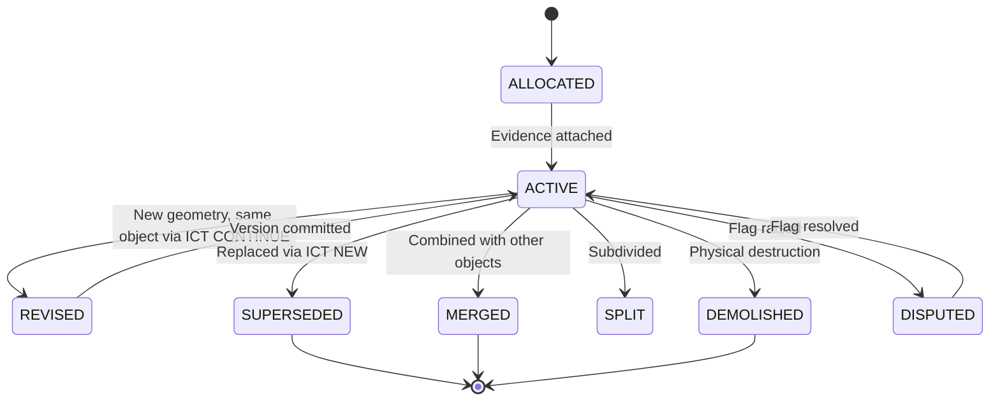

# 3. 3D ULPIN Grammar & Three-Layer Identity Architecture

### 3.1 Identifier Requirements (Formal)

| ID | Property | Rationale |
|----|---------|-----------|
| P1 | Global uniqueness, never reused | ULPIN goal; tombstones on demolition |
| P2 | Persistence across remodel/re-survey | Units outlive geometry versions |
| P3 | Backward-compatible with ULPIN; parent ULPIN unchanged | R2, India-first doctrine (A3) |
| P4 | Class-awareness (S, B, L, U, C, P, A, T, E, I) | R3–R8; adapted from Singapore lot-series pattern |
| P5 | Independent verifiability: anyone with geometry can re-derive digest and check | ULPIN's geometry-derived philosophy |
| P6 | Lineage: split/merge/supersede/demolish recorded | ULPIN changes ID on mutation |
| P7 | Spatial addressability (volume to cell cover) | R24 scalability |
| P8 | Fixed length, error-detecting, transcribable | ULPIN is fixed 14-char |
| P9 | Privacy-tiered (no owner data inside ID) | DPDP Act 2023 |
| P10 | Interoperable with LADM, IFC GlobalId, CityGML gml:id, OGC APIs | R27 |
| P11 | Deterministic, testable, conformance-suite-able | R25 "standardised" |

**Key Tension:** P5 (geometry-derived) vs P2/P6 (persistent through change). Geometry-only IDs die on every re-survey; registry-only IDs cannot be independently verified. **Resolution: a three-layer identity with a binding record.**

---

### 3.2 Three-Layer Identity Model

```
+--------------------------------------------------------------------------+
| LAYER 1  REGISTRY ID (RID)     persistent, opaque, class-typed, checked  |  <- the "3D ULPIN" string
+--------------------------------------------------------------------------+
| LAYER 2  NATURAL KEY (NK)      deterministic function of canonical       |
|          geometry @ version:   locator (interior point) + digest         |  <- verifiability (ULPIN-style)
+--------------------------------------------------------------------------+
| LAYER 3  SPATIAL ADDRESS (SA)  multi-resolution 3D grid cell cover       |  <- search / tiling / joins
+--------------------------------------------------------------------------+
             bound by  =>  BINDING RECORD (hash-chained version log)
       RID <=> NK(v) <=> SA(v) <=> evidence set <=> plan version <=> sign-off <=> parent lineage
```

| Layer | Persistence | Changes When | Recomputable? | Role |
|-------|------------|-------------|--------------|------|
| **RID** | Never changes for the object's life | Never (tombstoned on demolition) | No (registry-allocated) | The "3D ULPIN" string; printed, searched, quoted |
| **NK** | Changes whenever canonical geometry changes | Remodel, re-survey, as-built update | Yes, by anyone with the geometry | Tamper evidence, replication check |
| **SA** | Derived; can be recomputed | When grid is revised | Yes | Spatial search, tiling, range queries |
| **Binding Record** | Append-only, hash-chained | New version appended | Verifiable (hash chain) | Permanent link: RID <=> NK <=> evidence <=> plan <=> sign-off |

---

### 3.3 RID Grammar

```
3D-ULPIN  :=  ULPIN14 "-" BLD "-" CLS SEQ "-" CHK

ULPIN14   :=  the existing 14-char ULPIN of the *birth parcel* (unchanged)
              — real for parcels where ULPIN exists, PROXY otherwise

BLD       :=  "B" B32{4}
              building sequence within ULPIN scope
              "B0000" = no building (surface / airspace / subterranean / corridor volumes)

CLS       :=  one of:
                S  surface parcel column            L  level / storey volume
                B  building envelope (uses SEQ)     U  unit (apartment / commercial)
                C  common area (general / limited)  P  accessory (parking, storage)
                A  airspace lot (air-right volume)  T  subterranean lot / tunnel
                E  elevated corridor                I  utility-network segment

SEQ       :=  B32{5}
              registry-allocated sequence (Crockford base-32; no I L O U)

CHK       :=  1 check symbol, ISO 7064 MOD 37,36 over concatenated payload
```

**Fixed length.** Compact form (no hyphens) is canonical for storage; hyphenated for display.

**Example (synthetic):** `SYNTHETIC0001A-B0004-U0A3F1-7`

**Design Rationale:**

| Element | Rationale | Traced To |
|---------|-----------|-----------|
| Class letters | Mirror the PS's own object list; echo Singapore's type-separated series | R3–R8; B-CS.1 (adapted, not copied) |
| Opaque sequences | Persistence through remodelling; like SLA lot numbers and GERS IDs | P2; B-CS.1, B-CS.2 (adapted) |
| Human labels external | "Flat 1703", "Level 17", "B2" are attributes, not part of ID | Remodelling/renumbering would break persistence |
| Check symbol | Catches all single-character and adjacent-transposition errors | ISO 7064 MOD 37,36 property |
| ULPIN14 prefix | Backward-compatible extension of existing Indian standard | P3; India-first doctrine |

---

### 3.4 ISO 7064 MOD 37,36 Check Symbol Algorithm

**Input:** The payload string (ULPIN14 + BLD + CLS + SEQ), characters from the alphanumeric set `{0-9, A-Z}` (36 characters).

**Algorithm:**

```python
def compute_check_symbol(payload: str) -> str:
    M = 36   # modulus (number of valid characters)
    P = 37   # prime (M + 1)
    CHARSET = "0123456789ABCDEFGHIJKLMNOPQRSTUVWXYZ"

    def char_to_value(c: str) -> int:
        return CHARSET.index(c.upper())

    def value_to_char(v: int) -> str:
        return CHARSET[v]

    product = M  # initial value
    for ch in payload:
        v = char_to_value(ch)
        sum_ = (product + v) % M
        if sum_ == 0:
            sum_ = M
        product = (sum_ * 2) % P

    check_value = (M + 1 - product % M) % M
    return value_to_char(check_value)
```

**Error-Detection Properties:**
- Detects **100% of single-character substitution errors**
- Detects **100% of adjacent-character transposition errors**
- These are the two most common human transcription errors

**Conformance Test Vectors:**

| Test Case | Payload | Expected CHK | Inject Error | Detected? |
|-----------|---------|-------------|-------------|-----------|
| Valid RID | `SYNTHETIC0001AB0004U0A3F1` | `7` | — | — |
| Single substitution | Same, `B0004` changed to `B0005` | — | Not equal to `7` | Yes |
| Adjacent transposition | Same, `0A` changed to `A0` in SEQ | — | Not equal to `7` | Yes |

---

### 3.5 Object Class Taxonomy

| CLS | Object | Geometry Type | Parent | LADM Concept | Indian Legal Concept | Min. Evidence |
|-----|--------|--------------|--------|-------------|---------------------|--------------|
| **S** | Surface parcel column | Prism (ULPIN footprint extruded between policy subterranean limit and airspace ceiling) | — (ULPIN) | LA_Parcel | Survey/plot | E1 |
| **B** | Building envelope | Solid | S | LA_LegalSpaceBuildingUnit (envelope) | Sanctioned building | E1–E2 |
| **L** | Level / storey | Slab volume | B | Spatial unit (level) | Floor | E2–E3 |
| **U** | Unit (apartment/commercial) | Solid (multi-level allowed for duplex/mezzanine) | L(s) | Spatial unit / BAUnit link | Apartment/shop; carpet area, UDS | E3–E4 |
| **C** | Common area (general/limited) | Solid | B/L | Spatial unit + RRR | Common areas (RERA framework) | E3–E4 |
| **P** | Accessory (parking/storage) | Solid/Prism | B/L/S | Accessory spatial unit | Parking / allotted space | E3 |
| **A** | Airspace lot | Solid above S/B | S | Spatial unit (legal space) | Air-right / development rights | Plan + E1 |
| **T** | Subterranean lot / tunnel | Solid | S | Spatial unit (legal space) | Basement / underground space | Plan + E5 |
| **E** | Elevated corridor | Solid (multi-parcel) | anchor S | LA_LegalSpaceUtilityNetwork-like | Metro/viaduct right-of-way | Plan + E1 |
| **I** | Utility-network segment | Line to corridor volume (buffer) | T or S | LA_LegalSpaceUtilityNetwork | Right-of-way / easement | E5 |

---

### 3.6 Natural Key (NK) — Canonicalization Algorithm

```
canonicalise(V, profile):
  1  V := closed, orientable 2-manifold polyhedron (planar faces; MVP)

  2  Transform to profile CRS:
     geographic (lat, lon) per ULPIN convention + ellipsoidal height h
     also store local-level coordinate z_local and datum_id

  3  Snap vertices to declared precision p_xy, p_z
     (defaults: 1 cm / 1 cm)
     record p in metadata

  4  Merge coplanar adjacent faces
     Drop collinear vertices
     Outward normals (right-hand rule)

  5  Total order:
     Start each ring at lexicographically smallest (lat, lon, h)
     Order faces by (unit normal, plane offset, first vertex)

  6  Serialise to canonical bytes
     => same input produces same bytes on any machine
```

**NK Computation:**

```
NK.digest  = base32( SHA-256( bytes || CLS || datum_id || p_xy || p_z ) )
             SHA-256 truncated to 128 bits for display

NK.locator = quantise( interior_point(V) )
           = (lat 1e-7 deg, lon 1e-7 deg, h 0.01 m)
           => 3D Morton interleave

interior_point(V) = deterministic centre of largest inscribed sphere
                    (voxel distance-transform, fixed tie-break)
```

| Component | Purpose | Properties |
|-----------|---------|-----------|
| **NK.locator** | ULPIN-style geometry-derived part (interior point) | Stable for small deformations; human-interpretable location |
| **NK.digest** | Content hash — deliberately brittle | Any canonical change produces new digest; used for integrity/verification |

**Sameness under noise** is decided by the **Identity Continuity Test** (Section 3.8), **never** by digest equality.

---

### 3.7 Spatial Address (SA) — Multi-Resolution 3D Grid

- Multi-resolution 3D grid over a local metric frame
- Cell edge at level l = S_0 / 2^l
- Key = Morton (Z-order) interleave of (x, y, z) cell indices
- Volume to **cell cover** stored in a GiST/BRIN-friendly table for range queries
- Candidate global grid: GeoSOT-3D (fallback per A3.4: own octree/Morton grid)
- SA is derived and can be regenerated when the grid is revised

**Supported Queries:**

| Query | Method |
|-------|--------|
| "What lies at this point?" | Point to Morton key to SA lookup to RIDs |
| "What is in this bounding box?" | Box to Morton range to SA range scan to RIDs |
| "What is directly below this parcel?" | Parcel centroid to vertical Morton column to filter by z less than ground |

---

### 3.8 Lifecycle State Machine & Identity Continuity Test (ICT)

#### State Machine



**Rules:**
- An RID is **never reused** even after demolition (tombstoned)
- Supersede/split/merge create lineage edges
- Demolition leaves a tombstone record

#### ICT Algorithm

When new geometry G_new arrives for RID R (re-survey, remodel, as-built):

```
score = w1 * IoU3D(G_old, G_new)
      + w2 * (1 - shift / sigma_c_normalised)
      + w3 * [same class]
      + w4 * [same parent RID]
      + w5 * plan_link_agreement

Decision:
  IoU3D >= tau_hi AND same class/parent     => CONTINUE   (same RID, new NK, new version)
  IoU3D in [tau_lo, tau_hi)                 => AMBIGUOUS   => examiner review (evidence attached)
  G_new covers >=2 old objects / 1 old covers >=2  => MERGE / SPLIT (new RIDs, lineage edges)
  No old object overlaps                    => NEW          (new RID allocated)
```

**ICT Parameters:**

| Parameter | Initial Value | Source |
|-----------|-------------|--------|
| tau_hi | 0.90 | Design target; tuned on simulation |
| tau_lo | 0.60 | Design target; tuned on simulation |
| w1 (IoU weight) | 0.40 | Design judgement |
| w2 (shift weight) | 0.20 | Design judgement |
| w3 (class match) | 0.15 | Design judgement |
| w4 (parent match) | 0.15 | Design judgement |
| w5 (plan link) | 0.10 | Design judgement |

**3D Intersection-over-Union:**

```
IoU_3D(G, G') = vol(G intersection G') / vol(G union G')
```

Computed using `trimesh` mesh boolean operations.

---

### 3.9 Scope Rules for Hard Cases

| Case | Rule |
|------|------|
| **Volume spanning several parcels** (elevated corridor, tunnel, amalgamated building) | RID anchored to the parcel containing the interior point (*anchor ULPIN*); a `SPANS` relation lists every intersected parcel/ULPIN |
| **Surface parcel column (class S)** | ULPIN parcel extruded between policy subterranean limit and airspace ceiling relative to local ground reference; A/T lots carved out |
| **Parcel mutation** | RID keeps the *birth ULPIN*; registry stores `parcel_lineage(birth_ULPIN => current_ULPIN)`; resolution returns current parcel |
| **Unit across levels (duplex/mezzanine)** | One U-RID with N level-parts |
| **Voids / shafts / atria** | First-class `VOID` sub-objects inside parent volume (needed for volume-conservation rule) |
| **Boundary convention** | Unit volume boundary configurable: inner wall face / wall centre / outer face; recorded per object; must check per-state RERA carpet-area definition |

---

### 3.10 Conformance Suite (R25 "Standardised")

| Test Category | Test Description | Pass Criterion |
|--------------|-----------------|----------------|
| **Grammar** | Valid/invalid RID strings parsed | 100% correct acceptance/rejection |
| **Check symbol** | Inject all single-char substitutions and adjacent transpositions | 100% detected |
| **NK determinism** | Shuffled vertex order, rotated ring start, different machines | Identical digest every time |
| **Collision** | 10^6 to 10^7 synthetic allocations | Zero RID duplicates; zero digest collisions |
| **ICT** | Scripted remodel/split/merge scenarios | >= 95% correct on known expected outcomes |
| **Round-trip** | RID to LADM to IFC to CityGML export/import | ID preserved across all formats |

---

### 3.11 Prototype 3D Identifier Specification & Canonicalization

> **Important Legal / Status Disclaimer:**
> This is a **prototype identifier design** for research and evaluation. It is NOT the official Indian national ULPIN standard and is explicitly designated as a prototype schema.

#### Design Goals
- **Deterministic**: Given identical canonical geometry and coordinates, the identifier is mathematically invariant.
- **Unique**: Distinct within configured national/state namespaces without collisions.
- **Privacy-Preserving**: Opaque hashes preventing leakage of personal owner identities.
- **Versioned**: Any material geometry or semantic change issues a new lineage record without silent reuse.

#### Canonicalization Input Vector
```text
3D-<COUNTRY>-<CITY>-<CANONICAL_HASH>
```
Inputs to the canonical digest:
1. State/City LGD namespace
2. Parent parcel statutory anchor
3. Vertical object type code (Floor, Unit, Basement, Void)
4. Normalized spatial geometry WKT / Morton coordinate index
5. Floor elevation limits ($Z_{\text{min}}, Z_{\text{max}}$)
