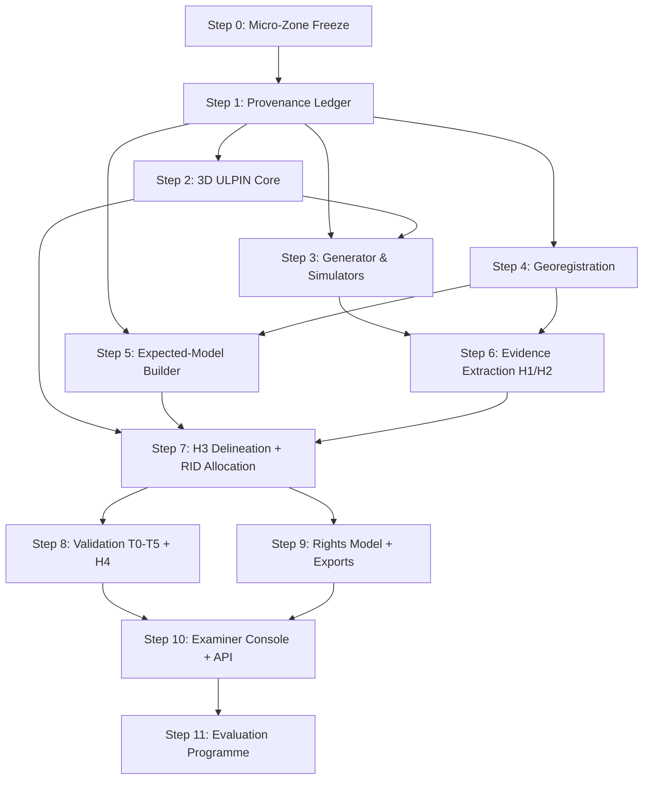

# Implementation Plan — 3D ULPIN Generation & Vertical Property Mapping System

**Project:** SIH26011  
**Version:** 1.0  
**Date:** 2026-09-20  
**Basis:** [architecture.md](architecture.md) · [config.md § 9.6](config.md#96-build-order-dependency-ordered)

---

## Overview

This document expands the 12-step dependency-ordered build sequence from `config.md § 9.6` into granular, actionable engineering sub-tasks. Each step specifies:

- **Deliverables** — concrete files, modules, and artefacts to produce.
- **Sub-tasks** — ordered, atomic engineering actions.
- **Acceptance Criteria** — the tests and observable outputs that signal completion.
- **Key Risks & Mitigations** — anticipated blockers with countermeasures.

The plan follows the **India-First Design Doctrine** (`A3`) and the **honesty metric** (`UNVERIFIABLE` is a first-class valid output), both described in [architecture.md](architecture.md).

---

## Target Repository Layout

```
reSIH/                           ← root
├── docs/
│   ├── architecture.md
│   ├── data.md
│   ├── features.md
│   ├── pipeline.md
│   ├── aiml.md
│   ├── validation.md
│   ├── contracts.md
│   ├── config.md
│   ├── decisions.md
│   └── implementation_plan.md   ← this file
│
├── src/
│   ├── core/
│   │   ├── grammar.py           ← RID / NK / SA / check-symbol
│   │   ├── registry.py          ← SQLite WAL registry + hash-chain audit log
│   │   ├── ict.py               ← Identity Continuity Test state machine
│   │   └── lineage.py           ← W3C PROV binding record + hash chain
│   ├── ingestion/
│   │   ├── provenance.py        ← data_provenance ledger + tagging
│   │   ├── plan_parser.py       ← DXF / IFC / raster floor-plan ingestor
│   │   ├── lidar_reader.py      ← LAS/LAZ via PDAL
│   │   ├── gis_reader.py        ← GeoTIFF / GeoJSON / Shapefile via GDAL
│   │   └── ifc_reader.py        ← IFC 4.3 via IfcOpenShell
│   ├── georegistration/
│   │   ├── cors_model.py        ← SoI CORS / GCP uncertainty model
│   │   ├── icp_align.py         ← ICP + plane-based sensor alignment
│   │   └── sigma_propagation.py ← Jacobian covariance propagation
│   ├── simulation/
│   │   ├── building_gen.py      ← parametric generator (all 10 classes)
│   │   ├── sensor_sim.py        ← synthetic LiDAR / drone render
│   │   └── defect_injector.py   ← controlled topological defect injection
│   ├── expected_model/
│   │   ├── plan_to_levels.py    ← plan → levels/units/commons extrusion
│   │   └── rera_validator.py    ← RERA carpet-area / unit-count cross-check
│   ├── ml/
│   │   ├── h1_building_extractor.py   ← ResNet-34 U-Net + KPConv
│   │   ├── h2_plan_vectoriser.py      ← U-Net + OCR floor-plan segmenter
│   │   ├── h2_level_inferencer.py     ← Viterbi DP height inference
│   │   ├── h3_delineation.py          ← Room-adjacency GNN + ILP solver
│   │   └── h4_topology_validator.py   ← Isolation Forest + active learning
│   ├── identity/
│   │   ├── allocator.py         ← RID allocation + ICT-triggered lifecycle
│   │   └── conformance.py       ← conformance-suite runner
│   ├── validation/
│   │   ├── t0_integrity.py
│   │   ├── t1_geometry.py
│   │   ├── t2_topology.py
│   │   ├── t3_reconciliation.py
│   │   ├── t4_admin.py
│   │   └── explain.py           ← explain-object builder
│   ├── rights/
│   │   ├── rrr_model.py         ← LADM Part 2 India-profiled RRR schema
│   │   └── export.py            ← LADM / IFC / CityGML / CityJSON exporter
│   ├── api/
│   │   └── main.py              ← FastAPI (all 7 endpoints)
│   └── console/
│       ├── index.html
│       ├── viewer.js            ← Three.js / CesiumJS 3D volume renderer
│       └── ui.js                ← layer filters, audit trail, sign-off UI
│
├── data/
│   ├── real/                    ← REAL-anchor data
│   ├── foreign/                 ← REAL-FOREIGN (Rotterdam AHN, SLA)
│   └── synthetic/               ← SYNTHETIC outputs from simulation
├── weights/                     ← pre-trained model weights (.pt / .onnx)
├── tests/
│   ├── conformance/
│   ├── unit/
│   └── integration/
└── registry.db                  ← SQLite WAL registry (runtime generated)
```

---

## Step 0 — Micro-Zone Freeze & Data Reconnaissance

**Spec ref:** [data.md](data.md)  
**R-IDs:** B3  
**Dependencies:** None

### Deliverables

- `data/zones.geojson` — WGS84 polygons for MZ-1, MZ-2, BZ-1, BZ-2.
- `data/PROVENANCE_INDEX.json` — full asset provenance ledger.
- `data/real/` seeded with all obtainable real-anchor files.
- `data/foreign/` seeded with Rotterdam AHN and SLA benchmark tiles.

### Sub-tasks

| # | Action | Output |
|---|--------|--------|
| 0.1 | Confirm MZ-1 (South Mumbai / Fort / Nariman Point) boundary polygon from MCGM GIS or Overture Maps. | `data/real/mz1_boundary.geojson` |
| 0.2 | Confirm MZ-2 (Dharavi / Mahim / BKC) boundary polygon. | `data/real/mz2_boundary.geojson` |
| 0.3 | Confirm BZ-1 (Bengaluru CBD / MG Road / Residency Road) boundary from UPOR / e-Aasthi or Overture. | `data/real/bz1_boundary.geojson` |
| 0.4 | Confirm BZ-2 (Whitefield / EPIP Zone) boundary polygon. | `data/real/bz2_boundary.geojson` |
| 0.5 | Identify at least one hero tower per zone from public RERA disclosure: building name, RERA project ID, disclosed unit count, floor count. | `data/real/{zone}_hero_tower.json` |
| 0.6 | Download Overture Maps building footprint tiles for all four zones (open-access, CC-BY-4.0 license). | `data/real/{zone}_overture_footprints.geojson` |
| 0.7 | Attempt MCGM open-data GIS parcel layer (MZ-1/MZ-2). Log provenance tag for each asset; note paywall status. | `data/real/mcgm_provenance_log.json` |
| 0.8 | Attempt UPOR / e-Aasthi open parcel data (BZ-1/BZ-2). Same provenance logging. | `data/real/upor_provenance_log.json` |
| 0.9 | Download Namma Metro Phase 1 & 2 alignment KML/GeoJSON (public BMRCL). Download Mumbai Metro Line 3 (Aqua Line) corridor alignment (public MMRC). | `data/real/bmrcl_alignment.geojson`, `data/real/mmrc_alignment.geojson` |
| 0.10 | Download Rotterdam AHN3/AHN4 point-cloud tiles (open-access). Download Singapore SLA 3D building dataset (flag unavailable if access fails; document access path). | `data/foreign/rotterdam_ahn/`, `data/foreign/singapore_sla/` |
| 0.11 | Download Bhuvan SRTM 30 m DEM for pilot bounding boxes. | `data/real/bhuvan_dem_{zone}.tif` |
| 0.12 | Write `data/PROVENANCE_INDEX.json`: every file, its `data_provenance` tag, license, download URL or "not available" note. | `data/PROVENANCE_INDEX.json` |

### Acceptance Criteria

- All four zone boundary GeoJSONs exist as valid WGS84 polygons.
- At least one hero tower per zone identified with RERA unit count and floor count.
- `PROVENANCE_INDEX.json` complete with zero unlabeled entries.
- Rotterdam AHN tiles available (or access path documented and SLA benchmark flagged accordingly).

### Key Risks

| Risk | Mitigation |
|------|-----------|
| MCGM GIS parcel data is paywalled | Use Overture Maps footprints (REAL, open-license) tagged `PROXY` for parcel polygons; never claim REAL for PROXY substitutes |
| RERA PDF plans are not machine-readable | Treat as scanned raster; feed through H2 plan vectoriser pipeline |
| Rotterdam AHN download bandwidth | Download minimal representative tile (500 m × 500 m) over hero zone equivalent area |

---

## Step 1 — Data Provenance Ledger & Real-Anchor Ingestion

**Spec ref:** [data.md](data.md), [architecture.md § L0](architecture.md#3-end-to-end-system-architecture-layered-model)  
**R-IDs:** D0  
**Dependencies:** Step 0

### Deliverables

- `src/ingestion/provenance.py` — `data_provenance` tagging, ledger schema, W3C PROV stub.
- `src/ingestion/gis_reader.py` — GDAL/Fiona-based GeoJSON/Shapefile/GeoTIFF reader.
- `src/ingestion/lidar_reader.py` — PDAL pipeline for LAS/LAZ → numpy structured array.
- `src/ingestion/ifc_reader.py` — IfcOpenShell bridge for IFC 4.3.

### Sub-tasks

| # | Action | Output |
|---|--------|--------|
| 1.1 | Define `ProvenanceRecord` dataclass: `source_id`, `file_path`, `data_provenance ∈ {REAL, REAL-FOREIGN, REAL-OWN, PROXY, SYNTHETIC}`, `crs`, `datum`, `resolution_m`, `accuracy_sigma_m`, `license`, `download_ts`. | `src/ingestion/provenance.py` |
| 1.2 | Implement `LedgerStore` using SQLite table `provenance_ledger`; write + query operations. | `src/ingestion/provenance.py` |
| 1.3 | Implement `GISReader.read_vector(path) → (GeoDataFrame, ProvenanceRecord)`. Handles GeoJSON, Shapefile, GPKG. Reprojects to WGS84/ITRF on read. | `src/ingestion/gis_reader.py` |
| 1.4 | Implement `GISReader.read_raster(path) → (np.ndarray, geo_transform, ProvenanceRecord)`. Handles GeoTIFF (DEM/DSM/ORI). | `src/ingestion/gis_reader.py` |
| 1.5 | Implement `LidarReader.read(path) → (np.ndarray, ProvenanceRecord)`. Structured array with fields `(x, y, z, intensity, classification)`. Uses PDAL JSON pipeline internally. | `src/ingestion/lidar_reader.py` |
| 1.6 | Implement `IFCReader.read(path) → (list[IfcSpaceGeometry], ProvenanceRecord)` via IfcOpenShell. Extract `IfcSpace`, `IfcBuildingStorey`, `IfcSlab` geometry. | `src/ingestion/ifc_reader.py` |
| 1.7 | Write `tests/unit/test_provenance.py`: assert all reader outputs carry non-null `data_provenance`; assert REAL objects never carry SYNTHETIC tag in same record. | `tests/unit/test_provenance.py` |
| 1.8 | Run ingestion on all Step-0 assets; populate `provenance_ledger` table in `registry.db`. | Populated DB |

### Acceptance Criteria

- Every object returned by any reader carries a non-null `ProvenanceRecord`.
- `test_provenance.py` passes with 100% coverage of provenance tag paths.
- `provenance_ledger` in `registry.db` contains one row per ingested file.

---

## Step 2 — 3D ULPIN Core (Grammar · Check Symbol · NK · SA · Registry · ICT · Lineage · Conformance)

**Spec ref:** [features.md](features.md), [contracts.md](contracts.md)  
**R-IDs:** R9, R25, R2  
**Dependencies:** Step 1

This is the most foundational step. Nothing downstream can allocate identities without it.

### Deliverables

- `src/core/grammar.py` — complete RID grammar, check symbol, NK, SA.
- `src/core/registry.py` — SQLite WAL registry with full schema.
- `src/core/ict.py` — Identity Continuity Test state machine.
- `src/core/lineage.py` — W3C PROV binding record + hash chain.
- `src/identity/allocator.py` — public allocation API.
- `src/identity/conformance.py` — conformance test suite runner.
- `tests/conformance/` — conformance test vectors.

### 2A — RID Grammar & Check Symbol

| # | Action | Output |
|---|--------|--------|
| 2A.1 | Implement `format_rid(ulpin14, bld_seq, cls, seq) → str`. Grammar: `ULPIN14 "-" BLD "-" CLS SEQ "-" CHK`. Validate all inputs at entry; raise `ValueError` for invalid class codes. | `src/core/grammar.py` |
| 2A.2 | Implement ISO 7064 MOD 37,36 check-symbol generation: `compute_check(payload: str) → str`. Alphabet: Crockford base-32 digits + uppercase letters (37 characters total). Pure Python, zero external dependencies. | `src/core/grammar.py` |
| 2A.3 | Implement `verify_check(rid: str) → bool`. Recompute check symbol from payload; compare against trailing check character. | `src/core/grammar.py` |
| 2A.4 | Implement `parse_rid(rid: str) → RIDComponents`. Dataclass fields: `ulpin14`, `bld_seq`, `cls`, `seq`, `chk`, `valid: bool`. | `src/core/grammar.py` |
| 2A.5 | Write conformance vectors in `tests/conformance/test_check_symbol.py`: (a) 10 known valid RIDs with precomputed CHK; (b) for each, 36 single-substitution variants — all must fail `verify_check`; (c) for each, adjacent-transposition variants — all must fail. | `tests/conformance/test_check_symbol.py` |

### 2B — Natural Key (NK) Algorithm

| # | Action | Output |
|---|--------|--------|
| 2B.1 | Implement `canonical_polyhedron(mesh: trimesh.Trimesh) → bytes`. Sort vertices by (z, y, x) lexicographic order; canonicalise face winding to consistent outward orientation; serialise to deterministic little-endian binary. | `src/core/grammar.py` |
| 2B.2 | Implement `compute_interior_point(mesh) → tuple[float, float, float]`. Use trimesh `contains_points` + random sampling inside bounding box; return the stable interior point. | `src/core/grammar.py` |
| 2B.3 | Implement `morton_encode_3d(x, y, z, origin, cell_size_m) → int`. 21-bit-per-axis interleaved Morton code; total 63-bit output. | `src/core/grammar.py` |
| 2B.4 | Implement `compute_nk(mesh, crs_epsg: int) → str`. NK = `base32(sha256(canonical_bytes))[:16] + "_" + morton_b32`. | `src/core/grammar.py` |
| 2B.5 | Write `tests/conformance/test_nk_determinism.py`: same mesh in two independent Python processes → identical NK string. Run 1,000 iterations. | `tests/conformance/test_nk_determinism.py` |
| 2B.6 | Write `tests/conformance/test_nk_collision.py`: generate 10^6 distinct unit-voxel meshes (1 m³ each, placed on a 3D grid); assert zero NK collisions. | `tests/conformance/test_nk_collision.py` |

### 2C — Spatial Address (SA) Grid

| # | Action | Output |
|---|--------|--------|
| 2C.1 | Implement `compute_sa_cover(mesh, levels: list[float] = [100, 10, 1]) → list[str]`. For each resolution level, compute Morton cell codes of all voxels intersecting the mesh at that granularity. | `src/core/grammar.py` |
| 2C.2 | Implement `sa_lookup(cell_code: str) → list[str]` using an in-memory R-tree / Morton index backed by `functools.lru_cache`. | `src/core/grammar.py` |
| 2C.3 | Benchmark: `sa_lookup` over a 10^6-object index returns results in < 100 ms. Document result in `docs/eval_results.md`. | Benchmark log |

### 2D — SQLite Registry Schema

| # | Action | Output |
|---|--------|--------|
| 2D.1 | Write `src/core/registry.py` with `init_db(path: str)`. Enable WAL mode (`PRAGMA journal_mode=WAL`). Create all five tables on first call. | `src/core/registry.py` |
| 2D.2 | `objects` table: `rid TEXT PRIMARY KEY`, `cls TEXT NOT NULL`, `ulpin14 TEXT NOT NULL`, `issuer_node_id TEXT NOT NULL`, `birth_ts TEXT NOT NULL`, `status TEXT CHECK(status IN ('ACTIVE','SUPERSEDED','TOMBSTONED'))`, `data_provenance TEXT NOT NULL`. | Schema |
| 2D.3 | `binding_versions` table: `version_id INTEGER PRIMARY KEY AUTOINCREMENT`, `rid TEXT NOT NULL REFERENCES objects(rid)`, `nk TEXT NOT NULL`, `sa_json TEXT NOT NULL`, `geometry_hash TEXT NOT NULL`, `plan_version TEXT`, `evidence_class TEXT`, `sigma_json TEXT`, `sign_off TEXT`, `prev_hash TEXT`, `this_hash TEXT NOT NULL`, `ts TEXT NOT NULL`. | Schema |
| 2D.4 | `audit_log` table: `log_id INTEGER PRIMARY KEY AUTOINCREMENT`, `rid TEXT`, `action TEXT`, `actor TEXT`, `finding_id TEXT`, `payload_json TEXT`, `ts TEXT NOT NULL`. | Schema |
| 2D.5 | Implement `insert_object(rid, cls, ulpin14, issuer_node_id, data_provenance)`. Implement `append_binding_version(rid, nk, sa, geometry_hash, ...)`. Hash chain: `this_hash = SHA256(prev_hash || json(version_payload))`. | `src/core/registry.py` |
| 2D.6 | Implement `resolve_rid(rid: str) → ObjectRecord`. Index on `rid` column. Benchmark: p99 < 1 ms in-process. | `src/core/registry.py` |
| 2D.7 | Implement `get_lineage(rid: str) → list[BindingVersion]`. Returns all versions in chronological order with hash-chain integrity flag. | `src/core/registry.py` |

### 2E — Identity Continuity Test (ICT)

| # | Action | Output |
|---|--------|--------|
| 2E.1 | Implement `ict_evaluate(old_geometry, new_geometry, cls) → ICTDecision`. Decision enum: `{CONTINUE, AMBIGUOUS, SPLIT, MERGE, NEW}`. | `src/core/ict.py` |
| 2E.2 | ICT rules: overlap_ratio = `vol(old ∩ new) / max(vol(old), vol(new))`. If ratio ≥ 0.8 and class unchanged and parent unchanged → `CONTINUE`. If 0.3 ≤ ratio < 0.8 → `AMBIGUOUS` (requires human examiner sign-off). If old geometry becomes multiple disjoint pieces → `SPLIT`. If multiple old geometries fuse → `MERGE`. Otherwise → `NEW`. | `src/core/ict.py` |
| 2E.3 | ICT scripted integration test: import MZ-1 hero tower; simulate a unit partition remodel; assert `SPLIT` is triggered; assert two new RIDs are allocated with lineage `SUPERSEDES` edges back to the original RID. | `tests/integration/test_ict_remodel.py` |

### 2F — Allocator & Conformance Suite

| # | Action | Output |
|---|--------|--------|
| 2F.1 | Implement `allocate(ulpin14, cls, mesh, evidence_class, plan_version, issuer_node='MH') → str`. Atomic sequence: compute NK → format RID with sequential SEQ → compute CHK → write `objects` row → write first `binding_versions` row. | `src/identity/allocator.py` |
| 2F.2 | Implement `conformance_run() → ConformanceReport`. Covers: grammar format checks on 100 random RIDs; check-symbol detection rates; NK determinism (100 iterations); NK collision test (10^6); SA cover for 3 resolution levels. | `src/identity/conformance.py` |
| 2F.3 | Federation test: allocate identical hero tower mesh on MH node and KA node. Assert RIDs differ (different `issuer_node_id` embedded); assert NK values are identical (deterministic from geometry alone). | `tests/conformance/test_federation.py` |

### Acceptance Criteria

- Conformance suite passes all test vectors with zero failures.
- 10^7 RID allocations (batch, in-process): zero collisions.
- NK determinism: identical mesh → identical NK across 1,000 independent runs.
- ISO 7064 MOD 37,36: 100% single-substitution detection; 100% adjacent-transposition detection.
- `resolve_rid` p99 latency < 1 ms (benchmarked, in-process).

---

## Step 3 — Parametric Generator & Simulators

**Spec ref:** [data.md](data.md), [pipeline.md](pipeline.md)  
**R-IDs:** M (must-haves), R3–R8  
**Dependencies:** Steps 1, 2

### Deliverables

- `src/simulation/building_gen.py` — parametric generator for all 10 object classes.
- `src/simulation/sensor_sim.py` — synthetic LiDAR / drone ortho renderer.
- `src/simulation/defect_injector.py` — controlled topological defect injection.
- `data/synthetic/mz1_hero/` and `data/synthetic/bz1_hero/` populated.

### Sub-tasks

| # | Action | Output |
|---|--------|--------|
| 3.1 | Implement `BuildingGenerator.generate(zone_id, floor_count, unit_count_per_floor, class_mix) → list[trimesh.Trimesh]`. Parameterised by Mumbai/Bengaluru regulatory setback rules (FSI/FAR per zone type). All outputs tagged `SYNTHETIC`. | `src/simulation/building_gen.py` |
| 3.2 | Class S — surface parcel column: extrude real footprint polygon from ground to sky limit. Source footprint from Overture (`PROXY`). | building_gen.py |
| 3.3 | Class B — building envelope: outer shell mesh. Class L — level volumes: horizontal slab bands between consecutive floor planes. | building_gen.py |
| 3.4 | Class U — unit volumes: partitioned rooms per floor (parametric rectangular layout). Class C — common areas: corridors, stairwells, lift lobbies. Class P — parking: basement grid cells. | building_gen.py |
| 3.5 | Class A — airspace lot: volume above building to regulated height limit. Class T — subterranean lot: basement volumes below ground datum. | building_gen.py |
| 3.6 | Class E — elevated corridor: Metro-line corridor volumes at elevation, spanning multiple parcel footprints, using real BMRCL/MMRC alignment GeoJSON as centreline. | building_gen.py |
| 3.7 | Class I — utility-network segment: synthetic water/sewer/electric conduits below ground. Depth uncertainty modelled as Gaussian `N(depth_nominal, sigma_z)`, sigma_z configurable (default 0.30 m). | building_gen.py |
| 3.8 | Implement `SensorSimulator.render_lidar(mesh_list, viewpoint_trajectory) → np.ndarray`. Ray-cast simulator: emits sparse LiDAR returns with configurable noise `sigma_r = 0.05 m`. Output tagged `SYNTHETIC`; save as LAS array. | `src/simulation/sensor_sim.py` |
| 3.9 | Implement `SensorSimulator.render_ortho(mesh_list, gsd_m) → (np.ndarray, geo_transform)`. Nadir orthophoto render with depth buffer. Tagged `SYNTHETIC`. | `src/simulation/sensor_sim.py` |
| 3.10 | Implement `DefectInjector.inject(objects, defect_type, magnitude) → (list[trimesh.Trimesh], DefectManifest)`. Defect types: `OVERLAP` (shift unit mesh by `magnitude` m into adjacent), `UNDERCOUNT` (delete one level mesh), `HEIGHT_ERROR` (shift slab by `magnitude` m), `SPLIT_ORPHAN` (disconnect one unit), `MISSING_COMMON` (remove corridor mesh). Records ground-truth manifest. | `src/simulation/defect_injector.py` |
| 3.11 | Run generator for MZ-1 hero tower: 20-storey, 4 units/floor, 2 basement levels (class T), 1 elevated metro corridor segment (class E). Assign real MCGM-sourced footprint (`PROXY`). Tag all volume outputs `SYNTHETIC`. | `data/synthetic/mz1_hero/` |
| 3.12 | Run generator for BZ-1 hero tower: 15-storey, 3 units/floor, 1 basement, adjacent Namma Metro corridor (class E). Tag all. | `data/synthetic/bz1_hero/` |
| 3.13 | Write `tests/unit/test_building_gen.py`: (a) every generated mesh is watertight (trimesh `is_watertight`); (b) sum of unit volumes per level equals level volume within 1% relative tolerance; (c) no two unit meshes have `vol(A ∩ B) > 0`. | `tests/unit/test_building_gen.py` |

### Acceptance Criteria

- All 10 object classes (S B L U C P A T E I) generated successfully.
- All generated meshes pass watertight and outward-normals checks.
- Defect injector produces reproducible, ground-truth defect manifests for all 5 defect types.
- `test_building_gen.py` passes with zero failures.

---

## Step 4 — Normaliser & Georegistration

**Spec ref:** [pipeline.md § 4.3](pipeline.md#43-georegistration--error-propagation-model)  
**R-IDs:** R18, D3  
**Dependencies:** Step 1

### Deliverables

- `src/georegistration/cors_model.py`
- `src/georegistration/icp_align.py`
- `src/georegistration/sigma_propagation.py`

### Sub-tasks

| # | Action | Output |
|---|--------|--------|
| 4.1 | Implement `CORSModel.get_sigma(fix_type: str, baseline_length_km: float) → tuple[float, float]`. Returns `(sigma_h, sigma_z)`. Model: `sigma_h = a + b * baseline`; `sigma_z = c * sigma_h` with `c = 1.5` (configurable). Fix types: RTK (`sigma_h ≈ 0.03 m`), DGNSS (0.30 m), single-point (5.0 m). | `src/georegistration/cors_model.py` |
| 4.2 | Implement datum transform: WGS84/ITRF ↔ Everest-1830 using `pyproj` with `NADGRIDS` shift file. Record transform name, epoch, and residual in `ProvenanceRecord`. | `src/georegistration/cors_model.py` |
| 4.3 | Implement `ICPAligner.align(source_cloud, target_model, max_iterations=50) → tuple[np.ndarray, np.ndarray]`. Returns `(4×4 transform_matrix, per-point residuals)`. Uses Open3D ICP (plane-to-plane correspondence). GCPs enter as soft constraints added to the ICP cost function. | `src/georegistration/icp_align.py` |
| 4.4 | Post-ICP residual analysis: if `median(residuals) > sigma_policy` → append `WARN` to provenance; if `> 3 * sigma_policy` → append `FAIL` for the georegistration step (pipeline continues but status is recorded). | `src/georegistration/icp_align.py` |
| 4.5 | Implement `propagate_sigma(sigma_input: np.ndarray, J: np.ndarray) → np.ndarray`. Computes `Sigma_out = J @ Sigma_in @ J.T`. Jacobians are defined per pipeline stage: rigid-body transform, prism extrusion, boolean intersection. | `src/georegistration/sigma_propagation.py` |
| 4.6 | Implement `combined_sigma(sigma_expected: float, sigma_observed: float) → float`. Returns `sqrt(sigma_expected² + sigma_observed²)`. This value becomes the `epsilon_v` threshold in T2 predicate checks. | `src/georegistration/sigma_propagation.py` |
| 4.7 | Write `tests/unit/test_georegistration.py`: (a) WGS84 → Everest-1830 → WGS84 round-trip error < 1 cm; (b) synthetic ICP with known 3D rotation+translation — recovered transform matches within 0.01 m; (c) sigma propagation with identity Jacobian — output equals input. | `tests/unit/test_georegistration.py` |

### Acceptance Criteria

- Datum round-trip error < 1 cm on test fixtures.
- ICP converges to the correct transform on clean synthetic input.
- Every geometry produced by this module carries an attached `sigma_json` dict.

---

## Step 5 — Expected-Model Builder (Plan → 3D Legal-Space Model)

**Spec ref:** [pipeline.md § 4.1](pipeline.md#41-plan-first-evidence-verified-workflow), [decisions.md](decisions.md)  
**R-IDs:** R17, F  
**Dependencies:** Steps 1, 4

### Deliverables

- `src/ingestion/plan_parser.py`
- `src/expected_model/plan_to_levels.py`
- `src/expected_model/rera_validator.py`

### Sub-tasks

| # | Action | Output |
|---|--------|--------|
| 5.1 | Implement `DXFParser.parse(path: str) → FloorPlanJSON`. Use `ezdxf` to extract: outer boundary polyline, room polygons, door/window arcs, dimension entities (for area labels). Handle AutoDCR-style layer naming conventions (`ROOM`, `WALL`, `DOOR`, `DIM`). | `src/ingestion/plan_parser.py` |
| 5.2 | Implement `IFCParser.parse(path: str) → FloorPlanJSON`. Use IfcOpenShell: extract `IfcSpace` (room volumes), `IfcBuildingStorey` (level elevations, `Elevation` attribute), `IfcDoor` / `IfcWindow` (openings that indicate adjacency). | `src/ingestion/plan_parser.py` |
| 5.3 | Define `FloorPlanJSON` schema (TypedDict): `{ version: str, source_provenance: str, levels: list[{ level_no: int, z_plan: float, z_next_plan: float, rooms: list[{ polygon_wkt: str, label: str, area_m2: float, type: Literal['unit','common','shaft','stairs'] }], unit_count: int, common_count: int }] }`. | `src/ingestion/plan_parser.py` |
| 5.4 | Implement `PlanToLevels.extrude(floor_plan: FloorPlanJSON) → list[LegalSpaceVolume]`. For each room at each level: call `trimesh.creation.extrude_polygon(polygon, height=(z_next_plan - z_plan))` and translate to `z_plan`. Assign class code from room `type` field. | `src/expected_model/plan_to_levels.py` |
| 5.5 | Handle special volumes: basement rooms → class T; parking grid cells → class P; shaft polygons → flagged as void (excluded from RID allocation); stairwells → class C. | `src/expected_model/plan_to_levels.py` |
| 5.6 | Implement `RERAValidator.check(floor_plan: FloorPlanJSON, rera_disclosure: dict) → ValidationResult`. Compare: `rera_disclosure['unit_count'] == floor_plan.levels[i].unit_count` (exact match required); carpet areas within 5% relative tolerance (NAKSHA threshold). Emit `WARN` at 5–10% discrepancy; `FAIL` above 10%. | `src/expected_model/rera_validator.py` |
| 5.7 | Implement multi-version plan handling: if two plan versions exist for the same building, record both as separate `binding_versions` entries and run ICT to establish the lineage relationship between expected models. | `src/expected_model/plan_to_levels.py` |
| 5.8 | Write `tests/unit/test_expected_model.py`: (a) DXF fixture → FloorPlanJSON → all rooms extracted; (b) all extruded volumes are watertight; (c) RERA validator emits WARN for 6% area discrepancy and FAIL for 12% discrepancy. | `tests/unit/test_expected_model.py` |

### Acceptance Criteria

- DXF and IFC parsers each produce a valid `FloorPlanJSON` for their test fixtures.
- All extruded volumes are geometrically valid (watertight, consistent normals).
- RERA validator correctly classifies 6% discrepancy as WARN and 12% as FAIL.

---

## Step 6 — Evidence Extraction (H1 Building Extraction · H2 Floor Segmentation · Level Inference)

**Spec ref:** [aiml.md § 6.1–6.2](aiml.md), [pipeline.md § 4.2–4.4](pipeline.md)  
**R-IDs:** R14–R16, R19–R21  
**Dependencies:** Steps 3, 4

### Deliverables

- `src/ml/h1_building_extractor.py`
- `src/ml/h2_plan_vectoriser.py`
- `src/ml/h2_level_inferencer.py`
- `weights/h1_unet.pt`, `weights/h2_vectoriser.pt`

### H1 — Building Extractor

| # | Action | Output |
|---|--------|--------|
| 6A.1 | Build U-Net with ResNet-34 encoder (torchvision pretrained on ImageNet). Input: 4-channel tensor `(R, G, B, nDSM)`, tile size 512×512 px. Decoder: transposed convolutions with skip connections. Output: 2-class segmentation mask (building / not-building). | `src/ml/h1_building_extractor.py` |
| 6A.2 | Implement combined loss: `L = 0.5 · BCE(y, ŷ) + 0.5 · Dice(y, ŷ)`. Dice: `1 − 2|A∩B| / (|A|+|B|)`. | h1_building_extractor.py |
| 6A.3 | Create synthetic training dataset: render 500 ortho tiles + nDSM tiles over MZ-1/BZ-1 hero towers using `SensorSimulator.render_ortho`. Building labels: real Overture footprints (`data_provenance = REAL`). | `data/synthetic/h1_train/` |
| 6A.4 | Train for 50 epochs (or early-stop when validation IoU > 0.80). Checkpoint to `weights/h1_unet.pt`. | `weights/h1_unet.pt` |
| 6A.5 | Benchmark on Rotterdam AHN tiles (REAL-FOREIGN): report IoU and Boundary F1 (2-pixel tolerance). Record in `docs/eval_results.md` with explicit `REAL-FOREIGN` provenance label and a note that this is not Indian data. | `docs/eval_results.md` |
| 6A.6 | Implement `H1Extractor.extract(ortho_tif, ndsm_tif) → tuple[Polygon, float, float]`. Returns `(footprint_polygon, height_m, sigma_height)`. Post-process: mask → polygonise → Douglas-Peucker simplification. | h1_building_extractor.py |
| 6A.7 | Optional KPConv branch: `H1Extractor.extract_from_cloud(las_path) → tuple[np.ndarray, trimesh.Trimesh]`. Returns `(building_point_cloud, envelope_mesh)`. Activate only if LiDAR is available. | h1_building_extractor.py |

### H2 — Plan Vectoriser & Level Inferencer

| # | Action | Output |
|---|--------|--------|
| 6B.1 | Build H2 plan U-Net: semantic segmentation of raster floor plans. Classes: `wall, door, window, room, shaft, text`. Input: grayscale raster tile. | `src/ml/h2_plan_vectoriser.py` |
| 6B.2 | Pre-train on CubiCasa5K (download, license-check, prepare). Fine-tune on 200 synthetic Indian-style plan rasters generated from `BuildingGenerator` parametric outputs. | `weights/h2_vectoriser.pt` |
| 6B.3 | Implement OCR stage: apply `pytesseract` to text-region crops to extract room labels and dimension strings. Map label text → room `type` field in FloorPlanJSON. | h2_plan_vectoriser.py |
| 6B.4 | Implement polygon extraction: segmentation mask → contour tracing → polygon simplification → `FloorPlanJSON` output compatible with Step 5 schema. | h2_plan_vectoriser.py |
| 6B.5 | Report domain gap: evaluate on (a) CubiCasa5K holdout, (b) synthetic Indian plans, (c) RERA raster if available. Log all in `docs/eval_results.md` with provenance labels. Never conflate performance across sets. | `docs/eval_results.md` |
| 6C.1 | Implement `LevelInferencer.extract_peaks(cloud: np.ndarray, axis='z') → list[tuple[float, float]]`. Compute z-histogram with bin width = 0.05 m; return local maxima as candidate slab heights `(z, density)`. | `src/ml/h2_level_inferencer.py` |
| 6C.2 | Implement Viterbi DP alignment (see [pipeline.md § 4.4](pipeline.md#44-height-inference-algorithm-viterbidp-peak-alignment)): states = plan level z-positions; observations = detected peaks; transition = monotonic-contiguous; emission = `N(z_expected, sigma_obs)`. Penalties `lambda_skip`, `lambda_extra` are configurable. | h2_level_inferencer.py |
| 6C.3 | Implement sufficiency check: if `n_support < n_min` OR `sigma_obs > sigma_max` → output `UNVERIFIABLE`. Never silently upgrade to `PASS`. | h2_level_inferencer.py |
| 6C.4 | Output per level: `{ z_obs: float, sigma: float, n_support: int, evidence_class: str, status: Literal['PASS','WARN','FAIL','UNVERIFIABLE'] }`. | h2_level_inferencer.py |
| 6C.5 | Write `tests/unit/test_level_inferencer.py`: (a) inject synthetic peaks at known z-positions — Viterbi recovers correct level assignments; (b) inject insufficient support points — assert status is `UNVERIFIABLE` (not `PASS`). | `tests/unit/test_level_inferencer.py` |

### Acceptance Criteria

- H1 IoU on synthetic data ≥ 0.80; Boundary F1 reported.
- Rotterdam AHN benchmark result recorded with `REAL-FOREIGN` label (any value acceptable; must be honest).
- H2 vectoriser produces valid `FloorPlanJSON` from raster test fixtures.
- Level inferencer returns `UNVERIFIABLE` (not `PASS`) for insufficient evidence in all test cases.

---

## Step 7 — Vertical Parcel Delineation (H3) · ICT · RID Allocation

**Spec ref:** [aiml.md § 6.3](aiml.md#63-h3--vertical-parcel-delineation-r22), [features.md](features.md)  
**R-IDs:** R10, R22  
**Dependencies:** Steps 2, 5, 6

### Deliverables

- `src/ml/h3_delineation.py`
- `src/identity/allocator.py` (extended with full delineation-to-allocation chain)

### Sub-tasks

| # | Action | Output |
|---|--------|--------|
| 7.1 | Implement room adjacency graph construction: nodes = room polygons per level; edges = shared wall segments (length > threshold). Node features: `[area, aspect_ratio, label_enc, level_position]`. Edge features: `[shared_wall_length, door_present]`. | `src/ml/h3_delineation.py` |
| 7.2 | Implement GNN proposal network using PyTorch Geometric (`GCNConv` or `SAGEConv`): input node/edge features → per-edge merge probability `p(merge) ∈ [0, 1]`. | h3_delineation.py |
| 7.3 | Implement ILP formulation: binary variables `x_{room,unit}`; objective = maximise sum of merge probabilities; constraints: (a) exact cover — every room assigned to exactly one unit; (b) volume conservation — `|sum(vol(units)) + sum(vol(voids)) + sum(vol(common)) − vol(level)| ≤ epsilon_v`; (c) connectivity — each unit is one connected component; (d) RERA unit count match when available. Solve with `scipy.optimize.milp` or `python-mip`. | h3_delineation.py |
| 7.4 | Implement greedy fallback: if ILP is infeasible or times out (30 s), use greedy graph partitioning by merge probability threshold. Log fallback in `ProvenanceRecord`. | h3_delineation.py |
| 7.5 | Output: `list[ProposedUnit]` per level. Fields: `polygon, z_bottom, z_top, cls, confidence, volume_m3, rera_unit_id (if matched)`. | h3_delineation.py |
| 7.6 | Integrate ICT: for each proposed volume, query the registry for any existing object with overlapping NK. Call `ict_evaluate`; route to `CONTINUE` (reuse RID), `SPLIT`, `MERGE`, or `NEW` allocation. | `src/identity/allocator.py` |
| 7.7 | Implement batch allocation in dependency order: allocate class B (building envelope) first → class L (levels) → class U/C/P (per level) → class A/T (airspace/subterranean) → class E/I (infrastructure). Each step writes to registry atomically. | `src/identity/allocator.py` |
| 7.8 | Write `tests/integration/test_full_allocation.py`: full delineation + allocation run on MZ-1 hero tower. Assertions: (a) every expected unit has a valid RID; (b) volume conservation within 1%; (c) no duplicate RIDs in registry; (d) NK re-computation matches stored NK. | `tests/integration/test_full_allocation.py` |

### Acceptance Criteria

- Volume IoU per unit ≥ 0.85 on synthetic ground-truth test buildings.
- Unit count exactly matches plan-stated count for clean synthetic input.
- ICT correctly routes remodel scenarios to `SPLIT` / `CONTINUE` / `MERGE` as designed.
- Zero RID collisions; every RID passes `verify_check`.

---

## Step 8 — Validation & Reconciliation Engine (T0–T5 · H4)

**Spec ref:** [validation.md](validation.md), [aiml.md § 6.4](aiml.md#64-h4--intelligent-topology-validation-r23)  
**R-IDs:** R23, R29  
**Dependencies:** Step 7

### Deliverables

- `src/validation/t0_integrity.py` through `t4_admin.py`
- `src/validation/explain.py`
- `src/ml/h4_topology_validator.py`

### T0–T4 Validators

| # | Action | Output |
|---|--------|--------|
| 8A.1 | **T0 — Data Integrity:** validate schema completeness (all required fields present); `crs` non-null; `data_provenance` tag present on every object; `geometry` non-null. Return `PASS / FAIL` per object. | `src/validation/t0_integrity.py` |
| 8A.2 | **T1 — Geometric Validity:** for every solid, assert: (a) watertight — `trimesh.is_watertight`; (b) consistent outward normals — `trimesh.is_winding_consistent`; (c) 2-manifold surface — no non-manifold edges; (d) no self-intersections. Apply cadastral relaxation: shell self-touch at a single point is allowed (annotated in explain object). | `src/validation/t1_geometry.py` |
| 8A.3 | **T2 — No-Overlap:** for all ownership-class pairs `(A, B)` within a building where overlap is prohibited, compute `vol(A ∩ B)` via trimesh boolean. Classify: `PASS` if 0; `WARN` if `≤ epsilon_v`; `FAIL` if `> epsilon_v`. If evidence class insufficient for the check: `UNVERIFIABLE`. | `src/validation/t2_topology.py` |
| 8A.4 | **T2 — Volume Conservation:** for each parent–children group: `|sum(vol(children)) + sum(vol(voids)) − vol(parent)| ≤ epsilon_v`. `epsilon_v` derived from propagated sigma. | `src/validation/t2_topology.py` |
| 8A.5 | **T2 — Containment:** for each parent–child pair (Level in Building; Unit in Level; Building in Parcel column): compute `vol(child \ parent)`. `PASS ≤ epsilon_v`; `WARN ≤ 3·epsilon_v`; `FAIL` otherwise. | `src/validation/t2_topology.py` |
| 8A.6 | **T2 — Vertical Order:** assert `z_bottom[i] < z_bottom[i+1]` for all consecutive levels. `FAIL` if violated. | `src/validation/t2_topology.py` |
| 8A.7 | **T3 — Plan-vs-As-Built (Hungarian Matching):** for expected levels (from plan) and observed levels (from H2), solve minimum-cost assignment via `scipy.optimize.linear_sum_assignment` with cost `|z_expected − z_observed|`. Output: `MATCH / SHIFTED / MISSING / EXTRA` per level with magnitude and sigma. | `src/validation/t3_reconciliation.py` |
| 8A.8 | **T3 — Footprint Alignment:** compute ICP residual between plan-derived footprint polygon and H1-extracted footprint. Report offset magnitude and sigma. | `src/validation/t3_reconciliation.py` |
| 8A.9 | **T4 — Administrative Consistency:** (a) UDS (undivided share) fraction sum per building = 1.000 ± epsilon; (b) every `Right.rid` resolves to a valid registry object; (c) no orphan `Right` records whose `rid` does not exist in `objects` table. | `src/validation/t4_admin.py` |
| 8A.10 | **Explain Object builder:** for every finding, construct `ExplainObject { finding_id, tier, predicate, rid_a, rid_b, magnitude, sigma, evidence_class, status, recommendation, plan_version, data_provenance }`. Persist to `audit_log` in registry via `insert_audit_log`. | `src/validation/explain.py` |

### H4 — Intelligent Topology Validator

| # | Action | Output |
|---|--------|--------|
| 8B.1 | Build feature vector per finding: `[violation_type_enc, magnitude, sigma, confidence, evidence_class_enc, cls_a_enc, cls_b_enc, volume_ratio, n_affected_objects, plan_version_age_days, provenance_enc]`. Encode categoricals as integers. | `src/ml/h4_topology_validator.py` |
| 8B.2 | Implement Isolation Forest (`sklearn.ensemble.IsolationForest`): fit on feature vectors from clean (zero-defect) synthetic buildings. Score each finding on defect-injected buildings. | h4_topology_validator.py |
| 8B.3 | Implement graph propagation: for a finding affecting node X in the spatial adjacency graph, propagate anomaly score to X's 2-hop neighbourhood. `final_score = max(local_score, max(propagated_scores))`. | h4_topology_validator.py |
| 8B.4 | Implement ranking: `rank_score = anomaly_score × impact_weight × examiner_priority_weight`. Sort findings descending; expose top-k to the examiner console (default k=20). | h4_topology_validator.py |
| 8B.5 | Implement active learning stub: record examiner decision `{ACCEPT, REJECT, MODIFY_TOLERANCE}` against each finding. Accumulate into a correction dataset. Re-train Isolation Forest when correction dataset reaches a configurable threshold (default: 50 decisions). | h4_topology_validator.py |
| 8B.6 | Seed initial tolerance with NAKSHA's published 5% parcel-area tolerance as the baseline calibration point. | h4_topology_validator.py |
| 8B.7 | Write `tests/integration/test_validation_pipeline.py`: inject all 5 defect types from `DefectInjector`; run full T0–T4 pipeline; assert every defect type produces ≥1 `FAIL` or `WARN` finding; assert H4 ranks the injected defect in top-3 findings. | `tests/integration/test_validation_pipeline.py` |

### Acceptance Criteria

- Every injected defect type detected by T0–T4.
- `UNVERIFIABLE` returned (not `PASS` or `FAIL`) for all checks where required evidence class is absent.
- H4 Precision@3 ≥ 0.60 on defect-injected synthetic buildings.
- Every finding has a corresponding `ExplainObject` in `audit_log`.

---

## Step 9 — Rights Model & Interoperability Exports

**Spec ref:** [decisions.md](decisions.md), [config.md § 9.5](config.md#95-standards-stack-reference)  
**R-IDs:** R26, R27  
**Dependencies:** Step 7

### Deliverables

- `src/rights/rrr_model.py`
- `src/rights/export.py`

### Sub-tasks

| # | Action | Output |
|---|--------|--------|
| 9.1 | Implement `Right` dataclass: `right_id, rid, right_type ∈ {OWNERSHIP, LEASE, EASEMENT, MORTGAGE, RERA_ALLOTMENT}, holder_pseudonym, uds_fraction, legal_basis_status ∈ {ENACTED, ASSUMED, INAPPLICABLE}, legal_act_ref, instrument_ref, registration_number, valid_from, valid_to`. | `src/rights/rrr_model.py` |
| 9.2 | Implement `Restriction` dataclass: `rid, restriction_type ∈ {SETBACK, FSI_CAP, HERITAGE_OVERLAY, NO_ALIENATION}, legal_basis, parameters_json`. | `src/rights/rrr_model.py` |
| 9.3 | Implement `Responsibility` dataclass: `rid, responsibility_type ∈ {MAINTENANCE, STRUCTURAL, FIRE_SAFETY}, responsible_party_pseudonym, scope_description`. | `src/rights/rrr_model.py` |
| 9.4 | Implement `RRRStore` using SQLite `rights` table. CRUD operations: `insert_right`, `get_rights_for_rid`, `update_right_status`. | `src/rights/rrr_model.py` |
| 9.5 | Assign `legal_basis_status` by class rule: U/C/P → `ENACTED` (Maharashtra Apartment Ownership Act 1970 / Karnataka Apartment Ownership Act 1972 / RERA 2016); A/T → `ASSUMED` (no enacted 3D airspace / subterranean title instrument). Hardcode act references. | `src/rights/rrr_model.py` |
| 9.6 | Implement LADM Part 2 export: `export_ladm(building_rid: str) → str` (XML or JSON-LD). Map: `Right → LA_Right`; `Restriction → LA_Restriction`; `LegalSpaceVolume → LA_SpatialUnit`. Include India-profile extensions: `carpet_area_rera_m2`, `uds_fraction`, `legal_act_ref`. | `src/rights/export.py` |
| 9.7 | Implement IFC export: map class-U volumes → `IfcSpace` with `LongName = RID`, `GlobalId = UUID(SHA256(RID)[:16])`. Wrap in `IfcBuilding → IfcBuildingStorey → IfcSpace` hierarchy. | `src/rights/export.py` |
| 9.8 | Implement CityGML 3.0 / CityJSON export: map B → `Building`, L → `BuildingPart`, U → `BuildingUnit`, with `gml:id = RID`. Include LOD2 solid geometry. | `src/rights/export.py` |
| 9.9 | Round-trip tests: allocate → export LADM → re-import → assert RID preserved exactly. Same for IFC and CityJSON. | `tests/integration/test_roundtrip.py` |

### Acceptance Criteria

- LADM, IFC, and CityJSON exporters produce schema-valid files.
- RID preserved exactly through every round-trip import/export cycle.
- `legal_basis_status` is `ASSUMED` for A and T classes; `ENACTED` for U/C/P with correct Act references.

---

## Step 10 — Examiner Console & FastAPI Service Layer

**Spec ref:** [contracts.md](contracts.md), [config.md § 9.3](config.md#93-examiner-console-specifications)  
**R-IDs:** R28, R30  
**Dependencies:** Steps 8, 9

### Deliverables

- `src/api/main.py` — FastAPI application with all 7 endpoints.
- `src/console/index.html`, `src/console/viewer.js`, `src/console/ui.js`.

### FastAPI Endpoints

| # | Endpoint | Contract Summary |
|---|----------|-----------------|
| 10A.1 | `POST /allocate` | Body: `{ ulpin14, cls, geometry_wkt, plan_version, evidence_class, issuer_node }`. Runs delineation → ICT → allocate. Returns `{ rid, nk, sa_cover, validation_status, explain_ids }`. |
| 10A.2 | `GET /resolve/{rid}` | Returns full `ObjectRecord` + latest `BindingVersion`. p99 < 1 ms in-process. |
| 10A.3 | `POST /verify` | Body: `{ rid, geometry_wkt }`. Recomputes NK from geometry; compares to registry NK. Returns `{ match: bool, nk_computed, nk_registry, delta }`. |
| 10A.4 | `GET /lineage/{rid}` | Returns all `BindingVersion` records in chronological order + hash-chain integrity flag. |
| 10A.5 | `GET /cover` | Query params: `bbox` (WGS84 minx,miny,maxx,maxy), `z_min`, `z_max`, `cls[]`, `provenance[]`. Returns paginated list of RIDs whose SA cover intersects the query volume. |
| 10A.6 | `GET /explain/{finding_id}` | Returns full `ExplainObject` from `audit_log`. |
| 10A.7 | `GET /validate/{rid}` | Runs T0–T4 + H4 on the object and its building. Returns `{ rid, tier_results: dict, findings: list, ranked_findings: list }`. |

For each endpoint: validate request schema; call the appropriate module; return response with HTTP 200 on success, 404 on unknown RID, 422 on schema violation. Attach FastAPI `/docs` (OpenAPI) and verify all schemas match [contracts.md](contracts.md).

### Examiner Console

| # | Action | Output |
|---|--------|--------|
| 10B.1 | Build Three.js / CesiumJS scene: load 3D volumes from `/cover` endpoint. Class-colour scheme: U = `#E8A048` (amber); C = `#6DB56D` (soft green); P = `#8A8A8A` (grey); A = translucent outline; T and I = below ground-plane cutaway; E = `#4A8BD4` (saturated blue). | `src/console/viewer.js` |
| 10B.2 | Implement **"Below / Above This Parcel"** query: on parcel-surface click, call `/cover` with `z_min=-100, z_max=+300` for the clicked parcel bbox. Render all intersecting RIDs as stacked depth-sorted volumes — this is the R1 headline query. | `src/console/viewer.js` |
| 10B.3 | Implement layer filters per [config.md § 9.3.2](config.md#932-layer-filtering): independent toggles for class (any subset of S B L U C P A T E I), `data_provenance` (REAL / REAL-FOREIGN / PROXY / SYNTHETIC), validation status (PASS / WARN / FAIL / UNVERIFIABLE), tier fidelity (A/B/C), evidence class (E1–E5). | `src/console/ui.js` |
| 10B.4 | Implement hover/tap card: on hover, show glow outline + side card with RID, class badge, provenance badge, validation status coloured dot. No persistent text labels at zone scale. | `src/console/ui.js` |
| 10B.5 | Implement four views: **Sanctioned Plan** (expected model), **As-Built** (observed model), **Difference** (overlay, colour-coded severity), **Section Cut** (horizontal or vertical slice at any position). | `src/console/viewer.js` |
| 10B.6 | Implement audit trail view: hash-chained log entries per RID displayed chronologically. Examiner sign-off button: records mock signature + timestamp in `audit_log` via API call. | `src/console/ui.js` |
| 10B.7 | Dark basemap (Mapbox Dark or equivalent). LOD switching: zone scale → class B (building envelope); medium zoom → class L (levels); street scale → class U/C/P (units). | `src/console/viewer.js` |
| 10B.8 | Run both named scenarios from [decisions.md](decisions.md): MZ-1 hero tower "below/above" query and BZ-1 metro-parcel clearance query. Capture screenshot/recording as demo deliverable in `data/demo/`. | `data/demo/` |

### Acceptance Criteria

- All 7 endpoints return correct data and match [contracts.md](contracts.md) schemas exactly.
- "Below/Above This Parcel" returns correct stacked RID list on MZ-1 hero tower (verified by checking class sequence against ground-truth generator output).
- Layer filter for `provenance=SYNTHETIC` shows zero REAL-tagged objects and vice versa.
- Hover card shows all four required fields.
- Dark basemap with LOD switching functional.
- Examiner sign-off persists a hash-chained `audit_log` entry with correct `prev_hash` linkage.

---

## Step 11 — Evaluation Programme

**Spec ref:** [validation.md](validation.md), [decisions.md](decisions.md)  
**R-IDs:** M4–M5  
**Dependencies:** All

### Deliverables

- `docs/eval_results.md` — consolidated, honest evaluation report.
- `tests/integration/test_evaluation.py` — automated evaluation runner.

### Sub-tasks

| # | Action | Output |
|---|--------|--------|
| 11.1 | **Honesty Pass:** audit every object in `registry.db`; assert `data_provenance` set on 100% of objects; assert `UNVERIFIABLE` appears in `audit_log` wherever evidence was insufficient; assert no `UNVERIFIABLE` finding was upgraded to `PASS` without examiner sign-off. | `docs/eval_results.md § Honesty Audit` |
| 11.2 | **REAL vs SYNTHETIC Separation:** call `/cover` with `provenance=SYNTHETIC`; assert zero REAL-tagged objects in response. Swap filter to `REAL`; assert zero SYNTHETIC-tagged objects. | Eval report |
| 11.3 | **Scale Test (M5):** run `allocate` in batch mode for 10^7 simulated unit volumes (offline, no API overhead). Assert zero collisions; record wall-clock time and peak RSS memory. | `docs/eval_results.md § Scale Test` |
| 11.4 | **`/resolve` Latency:** 1,000 sequential in-process calls. Assert p99 < 1 ms. | Eval report |
| 11.5 | **`/cover` Latency:** index with 10^6 objects; query with 100 m × 100 m bbox. Assert response time < 100 ms. | Eval report |
| 11.6 | **Defect Detection Curves:** for each of the 5 defect types (OVERLAP, UNDERCOUNT, HEIGHT_ERROR, SPLIT_ORPHAN, MISSING_COMMON) run at magnitudes 0.05 m, 0.10 m, 0.25 m, 0.50 m, 1.00 m. Plot detection rate vs magnitude curve. Include figures in `docs/eval_results.md`. | `docs/eval_results.md § Defect Detection` |
| 11.7 | **Conformance Suite Final Run:** run `conformance_run()` end-to-end. Assert 100% pass on all grammar, check-symbol, NK determinism, NK collision, SA cover tests. | Eval report |
| 11.8 | **Two-State Federation Test:** allocate 100 RIDs on MH node and 100 on KA node. Assert zero inter-node RID collisions. Assert `/resolve` routes correctly based on `issuer_node_id` embedded in each RID. | `tests/conformance/test_federation.py` |
| 11.9 | **LADM / IFC / CityJSON Round-Trip:** allocate all objects for MZ-1 hero tower → export all three formats → re-import → assert all RIDs preserved exactly. | Eval report |
| 11.10 | **Novelty Claims Verification:** for each of the 10 novelty claims in [decisions.md](decisions.md), write a one-paragraph justification with a pointer to the specific code path or test that demonstrates the claim. Add to `docs/eval_results.md`. | `docs/eval_results.md § Novelty Verification` |
| 11.11 | **R1 Headline Demo:** execute "what is below / above this parcel?" query on MZ-1 and BZ-1 hero towers. Assert result includes stacked RIDs of correct classes (U, C, P, T, B, E, I) in correct ascending z-order. Record in eval report. | Eval report |

### Acceptance Criteria

- 100% of registry objects carry a `data_provenance` tag.
- Zero REAL–SYNTHETIC conflation in any API output or console view.
- 10^7 batch allocation: zero collisions.
- `UNVERIFIABLE` produced for all evidence-insufficient checks (zero silent upgrades to PASS).
- All 10 novelty claims have corresponding test or demo evidence.
- R1 headline demo passes on both MZ-1 and BZ-1.

---

## Cross-Cutting Engineering Standards

### Coding Conventions

| Convention | Rule |
|-----------|------|
| Language | Python 3.11+ |
| Type Annotations | All public functions fully annotated; `mypy --strict` must pass |
| Docstrings | Google-style on every public class and function |
| Immutability | No in-place mutation of `ProvenanceRecord`, `BindingVersion`, or `ExplainObject` |
| Data Provenance | Every function producing a geometry or registry object must accept and return a `ProvenanceRecord`; never drop provenance |
| UNVERIFIABLE | Functions that cannot determine a result must return `UNVERIFIABLE`; never raise an exception or silently return `PASS` |
| Logging | `structlog` JSON structured logging; every allocation, ICT decision, and validation finding must emit a log event |
| Database | All SQLite writes in WAL mode; never `PRAGMA journal_mode=DELETE` |
| Secrets | No API keys, CORS tokens, or real survey coordinates committed to source control; use environment variables |

### Testing Pyramid

| Level | Location | Coverage Target |
|-------|----------|----------------|
| Unit | `tests/unit/` | ≥ 90% line coverage per module |
| Integration | `tests/integration/` | ≥ 1 integration test per build step (Steps 0–11) |
| Conformance | `tests/conformance/` | 100% of grammar / check-symbol / NK / SA conformance vectors pass |
| Evaluation | Step 11 | All Step 11 acceptance criteria pass |

### Non-Negotiable Data Provenance Rules

1. Every object written to the registry must have `data_provenance ∈ {REAL, REAL-FOREIGN, REAL-OWN, PROXY, SYNTHETIC}`.
2. `REAL` assets must carry a `license` and `download_url` in `data/PROVENANCE_INDEX.json`.
3. `SYNTHETIC` objects must carry the generator module name and version as `source_id`.
4. The examiner console must never display a `SYNTHETIC` object without a visible provenance badge.
5. Benchmark results on `REAL-FOREIGN` data must always appear in `docs/eval_results.md` with an explicit note that the data source is not Indian.

---

## Build-Order Dependency Graph



---

## Milestone Checkpoints

| Milestone | Completion Signal | Steps |
|-----------|-----------------|-------|
| **M0 — Data Ready** | Zone boundaries confirmed; `PROVENANCE_INDEX.json` complete | Step 0 |
| **M1 — Identity Engine Live** | Conformance suite passes; 10^6 allocations zero collisions; `/resolve` p99 < 1 ms | Steps 1–2 |
| **M2 — Synthetic World Built** | All 10 classes generated; defect injector working; simulated sensor outputs available | Steps 3–4 |
| **M3 — Expected Model Pipeline** | Plan-to-levels working for DXF + IFC; RERA cross-check functional | Step 5 |
| **M4 — Observed Model Pipeline** | H1 IoU > 0.80; Level inferencer returns UNVERIFIABLE correctly; H2 vectoriser operational | Step 6 |
| **M5 — Full Vertical Slice** | End-to-end MZ-1 + BZ-1: plan → delineation → RID allocation → validation → examiner console | Steps 7–10 |
| **M6 — Evaluation Complete** | All Step 11 criteria pass; `eval_results.md` complete and honest | Step 11 |

---

## Risk & Mitigation Register

| ID | Risk | Probability | Impact | Mitigation |
|----|------|------------|--------|-----------|
| R-A | Real Indian parcel/plan data unavailable or paywalled | High | Medium | Use Overture Maps (open-license, REAL) + Bhuvan DEM + RERA public disclosures; tag as PROXY; never claim REAL for synthetic substitutes |
| R-B | H1 underperforms on Indian building typologies | Medium | Medium | Train on synthetic Indian-style renders; report domain gap explicitly; Rotterdam benchmark is a secondary reference, not a primary standard |
| R-C | ILP solver infeasible on complex multi-unit plans | Medium | Low | Implement greedy fallback; log fallback in provenance; ILP not required for MVP demo |
| R-D | CubiCasa5K domain gap to Indian floor plans | High | Low | Fine-tune on synthetic Indian plans; report gap explicitly; do not over-claim H2 accuracy |
| R-E | SQLite WAL contention under batch allocation | Low | Low | Single-process mode; batch 10^7 offline without API overhead |
| R-F | Datum transform accuracy (Everest-1830 vs WGS84) | Medium | Medium | Use pyproj with NADGRIDS shift file; record transform epoch; flag residual > 1 cm as WARN |
| R-G | Rotterdam AHN / Singapore SLA data inaccessible | Low | Low | Both are open-access; flag unavailable tiles; benchmark is optional for MVP |
| R-H | Legal classification of A/T classes disputed | Low | High | `legal_basis_status = ASSUMED` is explicit; system issues spatial identity only, not legal title; full rationale in decisions.md |

---

*For the full specification behind each step, consult the [Modular Architecture Navigation Index](architecture.md#modular-architecture-navigation-index).*

---

## Step 12 — Architectural Weight Improvements

> **Status:** PLANNED (post-MVP). Strengthens institutional credibility, legal grounding, and frontend ergonomics. No breaking changes to existing 57-test suite.

### Context

The five sub-phases below address gaps identified during architecture review: the system proves correct but does not yet surface *why* it is legally authoritative (12A), cannot cross-reference the pre-existing Indian land-revenue identifier ecosystem (12B), requires complex client-side mesh processing for CesiumJS (12C), lacks a quantitative RERA plan-deviation score visible to examiners in the UI (12D), and must decouple territorial state laws (Mumbai, Bengaluru, Singapore) from synthetic/fictional sandbox models like Arasaka Tower while formally bounding photogrammetry as an external side project (12E).

---

### Sub-tasks

| # | Action | Output |
|---|--------|--------|
| 12A.1 | Define `CLASS_STATUTORY_MAP: Dict[str, StatutoryAnchor]` — one entry per class code. Class `U/C/P` → Maharashtra Apartment Ownership Act 1970 / Karnataka Apartment Ownership Act 1972 §4 & 5 + RERA 2016 §2(k), §14. Class `E` → Metro Railways Act 1978 §6. Class `T` → RFCTLARR Act 2013 (underground easement). Class `A` → Aircraft Act 1934 + MoCA CCZM. Class `S/B/L` → State Revenue Code (MahaBhulekh / Bhoomi). | `src/rights/rrr_model.py` |
| 12A.2 | Add `StatutoryAnchor` Pydantic model (`act_name`, `section`, `statutory_basis`, `carpet_area_standard`, `citation_ref`) to `src/api/schemas.py`. Populate in `GET /resolve/{rid}` from `CLASS_STATUTORY_MAP[cls]`. | `src/api/schemas.py`, `src/api/main.py` |
| 12A.3 | Unit test: resolve class-U RID; assert `statutory_anchor.act_name` contains `"Apartment Ownership Act"` and `statutory_basis == "ENACTED"`. | `tests/unit/test_api.py` |
| 12A.4 | Consolidate existing `legal_basis_status` class-rule logic in `src/rights/rrr_model.py` to use `CLASS_STATUTORY_MAP` as the single source of truth. | `src/rights/rrr_model.py` |
| 12B.1 | Add `legacy_index` table in `_init_db()`: `(idx_id INTEGER PK, id_system TEXT, legacy_value TEXT, rid TEXT NOT NULL, created_at TEXT, UNIQUE(id_system, legacy_value))`. | `src/core/registry.py` |
| 12B.2 | Implement `RegistryStore.insert_legacy_id(id_system, legacy_value, rid)` and `resolve_by_legacy(id_system, legacy_value) → Optional[str]`. | `src/core/registry.py` |
| 12B.3 | Extend `GET /resolve` — accept `legacy_system` + `legacy_value` query params; call `resolve_by_legacy()` when `rid` path param absent; return same `ResolveResponse`. | `src/api/main.py` |
| 12B.4 | Extend `AllocateRequest` body with optional `legacy_id: Optional[LegacyIdRequest]` block (`id_system`, `legacy_value`); call `insert_legacy_id()` inside the allocator immediately after RID is committed. | `src/api/schemas.py`, `src/api/main.py` |
| 12B.5 | Unit test: allocate with `legacy_id={id_system: "CTS", legacy_value: "Plot 412/1A"}`; then `GET /resolve?legacy_system=CTS&legacy_value=Plot+412%2F1A`; assert returned `rid` matches. | `tests/unit/test_api.py` |
| 12C.1 | Extend `GET /cover` with `format: Literal["summary", "geojson_3d"] = "summary"` query param. | `src/api/main.py` |
| 12C.2 | In `geojson_3d` mode, derive footprint `Polygon` from `[min_x, min_y, max_x, max_y]` of `spatial_index`; emit `height = min_z` and `extrudedHeight = max_z`; compute `fill_color` from `CLASS_COLOR_MAP` dict (matching existing console class colour scheme). | `src/api/main.py` |
| 12C.3 | Add `GeoJSON3DFeature` and `GeoJSON3DCollection` Pydantic models to `src/api/schemas.py`. | `src/api/schemas.py` |
| 12C.4 | Unit test: allocate 3 objects with known bbox; call `GET /cover?bbox=...&format=geojson_3d`; assert `extrudedHeight > height`, `fill_color` correct per class, geometry is `Polygon` type. | `tests/unit/test_api.py` |
| 12D.1 | Add nullable `sanctioned_carpet_area_sqm REAL` column to `binding_versions` table (migration-safe `ALTER TABLE … ADD COLUMN` in `_init_db`). Extend `AllocateRequest` and `append_binding_version()` to accept and store this field. | `src/core/registry.py`, `src/api/schemas.py` |
| 12D.2 | Implement `compute_rera_compliance(rid, store) → RERAComplianceResult` in `src/expected_model/rera_validator.py`: load `sanctioned_carpet_area_sqm` from registry; compute as-built area from the T1 mesh footprint projection; return `{sanctioned, as_built, delta, deviation_pct, rera_status, citation}`. Thresholds: PASS ≤ 2%, TOLERANCE_WARNING 2–5%, FAIL > 5%. | `src/expected_model/rera_validator.py` |
| 12D.3 | Call `compute_rera_compliance()` inside `GET /validate/{rid}` when `cls == "U"` and `sanctioned_carpet_area_sqm IS NOT NULL`; attach `RERAComplianceResult` as `rera_compliance` field in `ValidateResponse`. Return `null` gracefully for non-unit classes or missing plan data. | `src/api/main.py` |
| 12D.4 | Add `RERAComplianceResult` Pydantic model and optional `rera_compliance` field to `ValidateResponse` in `src/api/schemas.py`. | `src/api/schemas.py` |
| 12D.5 | Unit test: allocate class-U RID with `sanctioned_carpet_area_sqm=84.5` and extents producing ~87 m² as-built; call `/validate/{rid}`; assert `deviation_percentage ≈ 3.07` (±0.1) and `rera_compliance_status == "TOLERANCE_WARNING"`. | `tests/unit/test_api.py` |
| 12E.1 | Define `Jurisdiction = Literal["IN_MH", "IN_KA", "SG", "SANDBOX"]` in `src/core/grammar.py` and `src/api/schemas.py`; add `jurisdiction TEXT DEFAULT 'IN_MH'` column to `objects` table. | `src/core/grammar.py`, `src/core/registry.py`, `src/api/schemas.py` |
| 12E.2 | Parameterize statutory mapping by jurisdiction (`JURISDICTION_STATUTORY_MAP`); route Mumbai (`IN_MH`) to MahaRERA/MOA, Bengaluru (`IN_KA`) to K-RERA/KAOA, Singapore (`SG`) to SLA/LTA, and `SANDBOX` to `SANDBOX_BYPASS` (no state law assigned). | `src/rights/rrr_model.py` |
| 12E.3 | In `compute_rera_compliance()` and administrative validators (T4), check object jurisdiction: when `SANDBOX` (e.g. Arasaka Tower fictional models), skip state RERA penalties with status `EXEMPT_SANDBOX`; enforce pure 3D manifold/topological non-overlap (T0, T1, T2). | `src/expected_model/rera_validator.py`, `src/validation/t4_admin.py` |
| 12E.4 | Formalize the photogrammetry pipeline boundary: relegate 2D drone image SfM/NeRF processing to an external side project; keep core backend consumption locked to 3D meshes (OBJ/GLTF/IFC) and LiDAR (LAS/LAZ). | `docs/decisions.md`, `docs/pipeline.md` |
| 12E.5 | Unit test: allocate Arasaka Tower synthetic parcel under `jurisdiction="SANDBOX"`; call `/validate/{rid}` and `/resolve/{rid}`; assert topology passes, RERA is exempt, and statutory basis is `SANDBOX_BYPASS`. | `tests/unit/test_api.py` |

### Acceptance Criteria

- `GET /resolve/{rid}` always returns `statutory_anchor` with non-null `act_name`, `section`, and `citation_ref` for real jurisdictions (`IN_MH`, `IN_KA`, `SG`), and returns `SANDBOX_BYPASS` for fictional/sandbox models (`SANDBOX`).
- `GET /resolve?legacy_system=CTS&legacy_value=...` resolves to the correct RID in ≤ 1 ms (indexed lookup).
- `GET /cover?format=geojson_3d` returns valid RFC 7946 GeoJSON loadable directly by `Cesium.GeoJsonDataSource.load()` with no client-side processing.
- `GET /validate/{rid}` on a class-U object with plan data returns `rera_compliance` with correct `deviation_percentage` and RERA statutory citation; returns `null` or `EXEMPT_SANDBOX` for sandbox models and absent plan data.
- Fictional mega-structures (e.g. Arasaka Tower) can be ingested and validated topologically without triggering spurious state-specific bye-law or RERA violations.
- All 57 existing tests continue to pass; new sub-phase tests bring the total to ≥ 75.

---

### Files Affected Summary

| File | Change |
|------|--------|
| `src/core/grammar.py` | Add `Jurisdiction` literal enum |
| `src/rights/rrr_model.py` | Add `JURISDICTION_STATUTORY_MAP`; consolidate `legal_basis_status` logic |
| `src/core/registry.py` | Add `legacy_index` table; `jurisdiction` column in `objects`; `insert_legacy_id`; `resolve_by_legacy`; `sanctioned_carpet_area_sqm` column |
| `src/expected_model/rera_validator.py` | Add `compute_rera_compliance()` with jurisdiction sandbox exemption |
| `src/validation/t4_admin.py` | Guard state-specific administrative checks by jurisdiction |
| `src/api/schemas.py` | Add `StatutoryAnchor`, `LegacyIdRequest`, `GeoJSON3DFeature`, `GeoJSON3DCollection`, `RERAComplianceResult`; extend `AllocateRequest`, `ResolveResponse`, `ValidateResponse` with `jurisdiction` |
| `src/api/main.py` | Extend `/resolve`, `/cover`, `/validate`, `/allocate` handlers with jurisdiction logic |
| `tests/unit/test_api.py` | Add 6 new test cases (12A.3, 12B.5, 12C.4, 12D.5, 12E.5) |